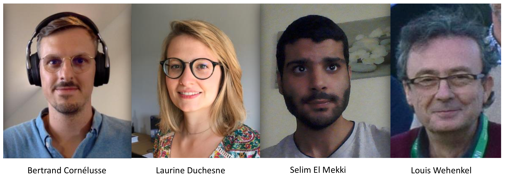
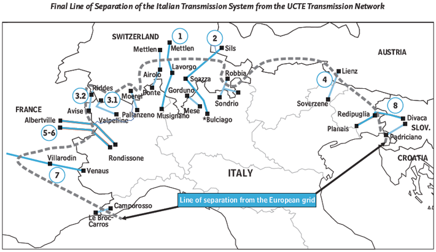
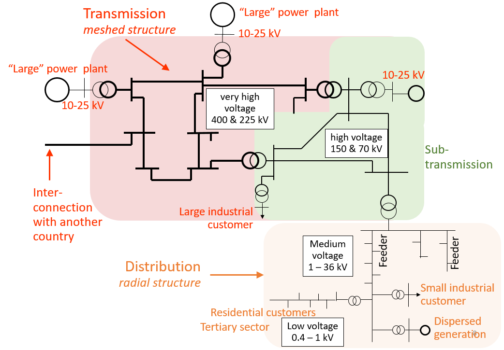
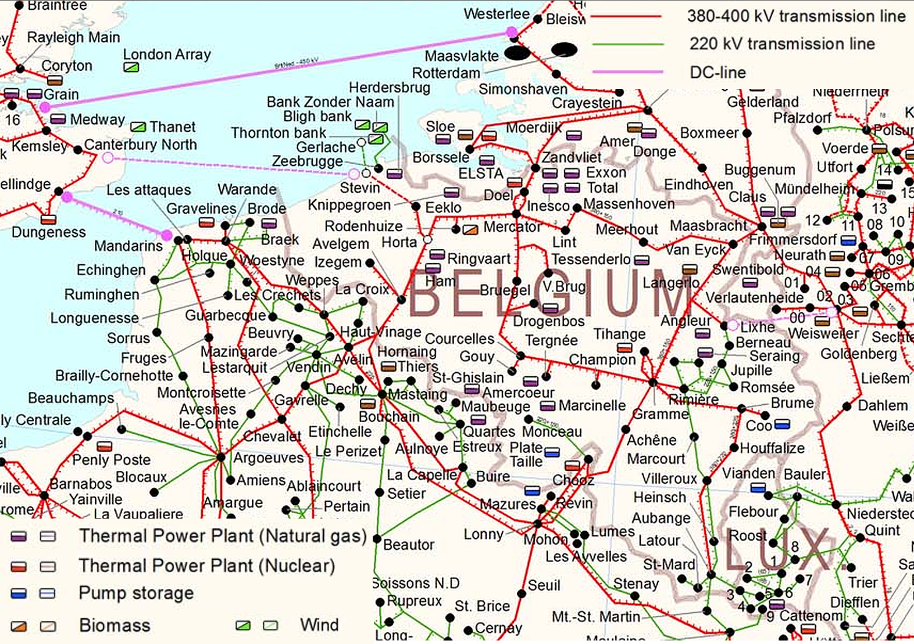
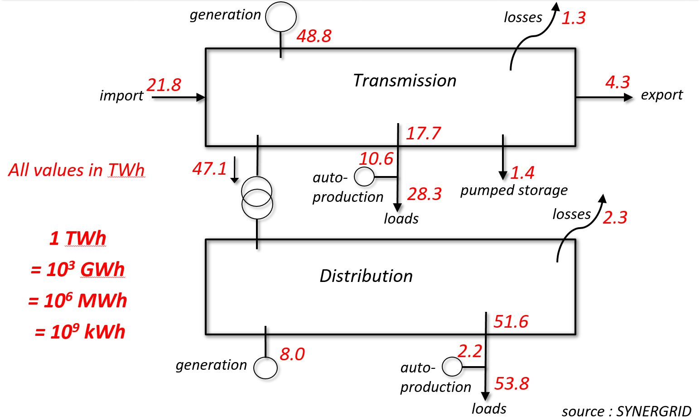
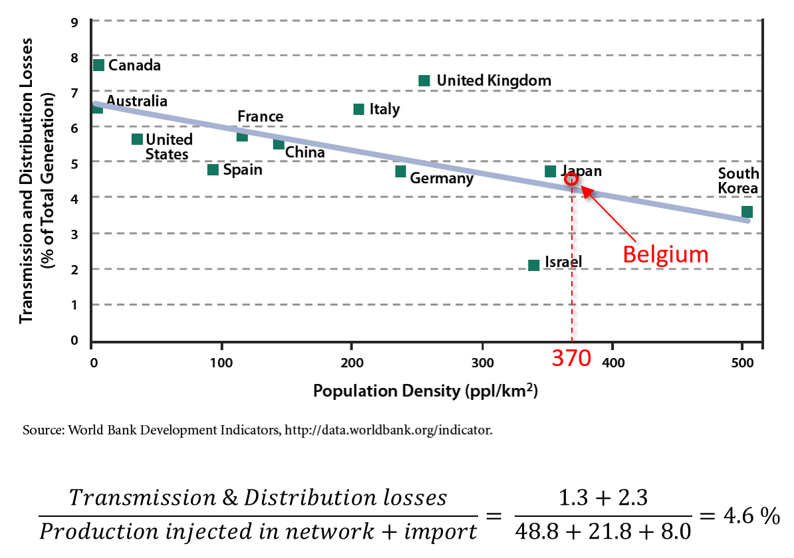
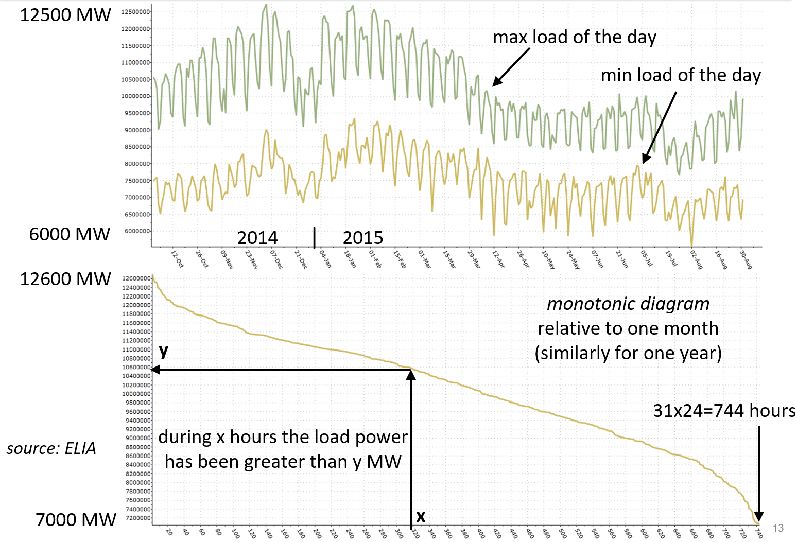
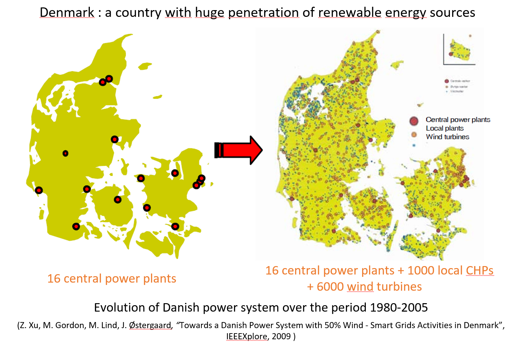
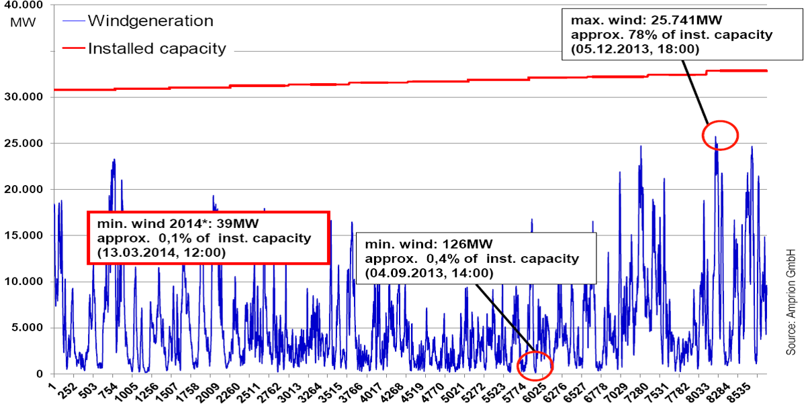
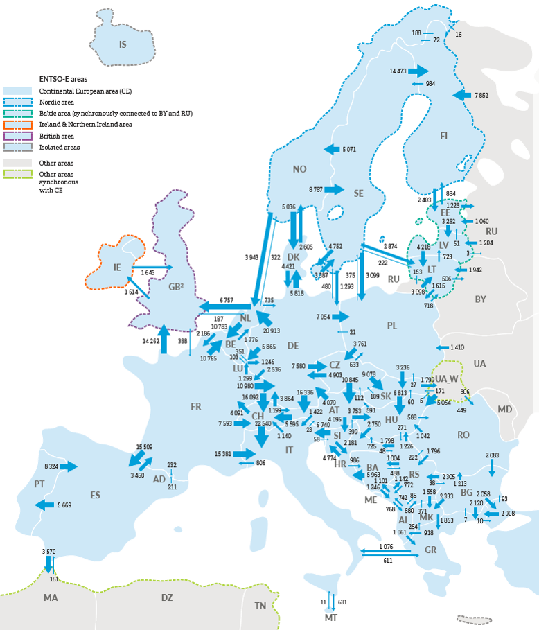

class: middle, center, title-slide
count: false

# ELEC0447 — Analysis of electric power and energy systems

Course organization and introduction

  

Bertrand Cornélusse 
[bertrand.cornelusse@uliege.be](mailto:bertrand.cornelusse@uliege.be)

---

class: center, middle
count: false

<iframe src="https://giphy.com/embed/FQyQEYd0KlYQ" width="480" height="266" frameBorder="0" class="giphy-embed" allowFullScreen></iframe>
# Welcome to ELEC0447

---

# Course organization

 - Theory lectures (maximum 2 hours) 
 - Practice sessions (remainder of the session) $\rightarrow$ bring your laptop
 - Homework assignments:  
 - **Mandatory test on September 23**, on sinusoidal steady-state analysis (reminder given after this introduction)
  - For self-assessment, but mandatory. 
 - Project: 
  - Analyze a system using power flow analyzes (power flow solver provided)
  - (Present your results to the class)
 - Oral exam in January
  - Theory (list of questions available) and one exercise

---

# The teaching team

.center[.width-100[]]

---

# References

Main reference book:
- Mohan, Ned. Electric power systems: a first course. John Wiley & Sons, 2012.

Other references: 
- Course notes of ELEC0014 by Pr. Thierry Van Cutsem. (In french)
- Weedy, Birron Mathew, et al. Electric power systems. John Wiley & Sons, 2012.

---

class: center, middle
# Introduction
*Adapted from ELEC0014 introduction by Thierry Van Cutsem*

---

# Objectives of this lecture

- Show the overall structure of an electric power system
- Highlight a few important features of power system operation
- Illustrate those on the Belgian and European systems
- Present some orders of magnitude it is important to have in mind
- Introduce some terminology

---

## A large scale system

In modern society, electricity has become a “commodity”:

*“marketable good or service whose instances are treated by the market as equivalent with no regard to who produced them”*

- “Behind the power outlet” there is a complex industrial process
- Electric energy systems are the largest systems ever built by man
 - thousands of km of overhead lines and underground cables, of transformers
 - tens/hundreds of power plants + a myriad of distributed energy sources
 - devices to (dis)connect elements: substations, circuit breakers, isolators
 - protection systems: to eliminate faults
 - real-time measurements : active and reactive power flows, voltage magnitudes, current magnitudes, energy   meters, phasor measurement units
 - controllers: distributed (e.g. in power plant) or centralized (control center)
 - etc.
- Unlike most other complex systems built by man, power systems are exposed to external “aggressions” (rain, wind, ice, storm, lightning, etc.)

---

## Low-probability but high-cost failures

In spite of those disturbances, modern electric power systems are very reliable. Assume a duration of power supply interruption of 0.5 hour / year
.center[**availability =** (8760−0.5)/8760= **99.994 %** !]

However, the cost of unserved energy is high
 - average cost used by CREG (Belgian regulator) to estimate the impact of forced load curtailment: 8.3 k€/MWh (source: Bureau fédéral du plan)
 - varies with time of the day : between 6 and 9 k€/MWh
 - varies with type of consumer : 2.3 k€/MWh for domestic, much higher for industrial
 - even higher average cost considered elsewhere (e.g. 26 k€/MWh in France !)

Large-scale failures (blackouts) have tremendous societal consequences
 - next two slides: examples of blackouts and their impacts

---

## USA-Canada blackout, August 2003

.width-45[]
.width-45[]

- 50 million people disconnected initially
- 61 800 MW of load cut in USA & Canada
- cost in USA : 4 to 10 billion US $
- in Canada : 18.9 million working hours lost
- 265 power plants shut down
- restoration : from a few hours to 4 days

.footnote[Source : North American Electric Reliability Council (NERC)]

---

## Italian blackout, September 2003

- Cascade tripping of interconnection lines $\rightarrow$ separation of Italy from rest of UCTE system
.center.width-50[]
- Deficit of 6.7 GW imported in Italian system $\rightarrow$ frequency to collapse in Italy
- 340 power plants shut down, 55 million people disconnected initially - 27 GW lost  (blackout occurred during night)
- Estimated cost of disruption  $\approx$ 139 million US $
- Restoration time: 15 hours

.footnote[Source : Union for the Co-ordination of Transmission of Electricity (UCTE) which is now part of ENTSOe]

---

## Network: from early DC ...

End of 19th century : Gramme, Edison devised the first generators, that produced Direct Current (DC) under relatively low voltages

Impossibility to transmit large powers with direct current:
 - $\text{power} = \text{voltage}\times \text{current}$
  - if the voltage cannot be increased, the current must be
  - but  $\text{power lost} = \text{resistance} \times \text{current}^2$        $\rightarrow$  big waste of  energy
  - and large sections of conductors required               $\rightarrow$  expensive and heavy
 - Hard to interrupt a large DC current (no zero crossing), for instance after a short-circuit

---
## Network: ... to present high-voltage AC
Changing for Alternating Current (AC)
 - voltage increased and lowered thanks to the transformer
 - standardized values of frequency : 50 and 60 Hz (other values used at a few places)

Larger nominal voltages have been used progressively
 - up to 400 kV in Western Europe
 - up to 765 kV in North America
 - experimental lines at 1100 kV or 1200 kV (Kazakhstan, Japan, etc.)

---

## Structure of electric network  (case of Belgium)

.center.width-100[]

.footnote[In Belgium there are 30 and 36 kV underground cable networks, in Brussels and Antwerp areas. These are meshed and play the role of sub-transmission.]

---

## 400 (and 220 kV) grid in Belgium and interconnections

.center.width-100[]

---

## Length of network by voltage level and type in Belgium

.center.width-100[]

.footnote[source : SYNERGRID, as of December 2008]

---

##  Electrical energy balance over the year 2018 in Belgium

.center.width-100[]

---

##   Network losses

.center.width-90[]

Transporting and distributing electrical energy is an industrial process with a relatively high efficiency

---

##  Consumption outlook

.center.width-100[]

---

##  

.center.width-100[]

---

##  Peak load on some grids

.center.width-100[]

---

##  From large centralized to small dispersed power plants

.center.width-100[]

---

class: middle

# Energy outlook for Belgium

---

##   Sources of electrical energy in Belgium in 2018

.center.width-100[]

.footnote[source : ENTSOE]

---

##  Comments

- “Nuclear generation capacity” involves all units, even those temporarily shut down for technical reasons, or waiting for the decision to extend their lifetime
- Gas power plants includes small CHP (Combined Heat Power) units
- Same for biomass plants
- Purposes of pumping storage :   
   - pumping : convert electrical energy into mechanical (potential) energy when  demand is low compared to available generation (e.g. during night)
   - turbining : reverse operation when demand is high (e.g. at day peak)$\rightarrow$  “peak shaving” and “valley filling” of daily load curve 
   - efficiency of whole cycle  $\approx$  85 % 
   - usually profitable since cost of electricity higher when demand is high
   - fast reserve : a hydro unit can be started (resp. pumping stopped) quickly to replace a generation unit that is taken out of service 
   - allows keeping base units (e.g. nuclear) in operation when load is very low

---

##  Comments: capacity factor

- Capacity Factor:
 $\frac{\text{energy produced in 1 year (MWh)}}{\text{generation capacity (MW)} \times 365 \times 24 (h)}$
 - usually close to 90 % for nuclear, but some Belgian units have high unavailability 
 - note the low value for solar energy!

---

##   Some trends in Belgium

- Early retirement of gas power plants not enough competitive on electricity market, too expensive to maintain
 - political decision to keep a “strategic reserve” !
 - [Angleur](https://edfluminus.edf.com/edf/la-centrale-electrique-d-angleur)
- [Biomass plant of "Les Awirs" just decommissioned.](https://www.rtbf.be/info/regions/liege/detail_flemalle-fermeture-de-la-plus-grande-centrale-biomasse-de-wallonie-aux-awirs?id=10555470)
- Natural hydro resources saturated in Belgium
 - there are plans to expand the pumping storage
 - Coo power plant : currently  $(3 \times 158  +  3 \times 230  =)$ 1164 MW  installed capacity
- Wind energy :
 - public opposition to new on-shore wind farms (densely populated country !)
 - NIMBY attitude :   Not In My BackYard

---

##   Some trends in Belgium (...)

- off-shore wind farms have a higher capacity factor than on-shore ones: wind is more steady in the sea
- Belgian off-shore wind farms in 2018 : 
 - 5 wind parks with an installed capacity of 1186 MW have produced 3,408 TWh
 - Capacity Factor =  $(3,408 \times 10^6)/(1186 \times 365 \times24)$ =  32 %
- still a great potential for new off-shore wind farms :
 - 3 under construction (+ 1076 MW) $\rightarrow$  8 TWh production expected in 2020

---

class: middle

# Renewable generation

---

##  Wind generation potential

https://globalwindatlas.info/

.center.width-100[]
.center[Hour of the year 2013]

---

##  PV generation potential

https://re.jrc.ec.europa.eu/pvg_download/map_index_c.html#!

.center.width-100[]
.center[Hour of the year 2013]

---

class: middle
# Power balance

---

##  The power balance issue

.center.width-80[]
Conservation of Energy over an infinitesimal time $dt$:
$$dE\_{gen} = dE\_{cons} + dE\_{lost} + dE\_{net}$$

Introducing the corresponding powers at time $t$:
$$p\_{gen}(t).dt = p\_{cons}(t).dt + p\_{lost}(t).dt + p\_{net}(t).dt$$
Hence 
$$p\_{gen}(t) = p\_{cons}(t) + p\_{lost}(t) + p\_{net}(t)$$

---

$p\_{cons}(t)$: The consumers decide how much power they want to consume !
- this demand fluctuates at any time

$p\_{lost}(t)$: Losses mainly due to Joule effects  $\rightarrow$ depend on currents in components
- kept as small as possible, not really controllable

---

$p\_{net}(t)$: Network elements which store electrical energy : inductors and capacitors
- In sinusoidal steady state, the power in an inductor (or a capacitor) reverts every quarter of a period, and is zero on the average
 - in balanced three-phase operation, the sum of the powers in the inductors/capacitors of the three phases is zero at any time !
 - hence, electrical energy cannot be stored in the AC network
- to be stored, electrical energy has to be converted into another form of energy
 - mechanical: e.g. potential energy of water     in the upper reservoir of a pumping station, flywheels, etc.
 - chemical: batteries, but amounts of stored energy are still very small !! Really?
  - [Hornsdale Power Reserve](https://en.wikipedia.org/wiki/Hornsdale_Power_Reserve)
  - [NGK's batteries](https://www.energy-storage.news/blogs/sponsored-ngks-nas-grid-scale-batteries-in-depth)

---

## Conclusion

The variations of load power have to be compensated by the generators but the conversion (primary energy $\rightarrow$ electrical energy) is not instantaneous
 - example: changing the flow of steam or water in a turbine takes a few seconds
Hence, an “energy buffer” is needed to quickly compensate power imbalances 
- this is provided by the rotating masses of synchronous generators
- a deficit (resp. excess) of generation wrt load results in a decrease (resp. increase) of speed of rotation speeds (and hence, frequency)
- in a synchronous generator and its turbine, kinetic energy $\approx$ nominal power of the generator produced during 2 to 5 seconds
- controlling the power balance in a power system without rotating machines (only power electronic interfaces) would be a challenge (still at research level) !
Larger variations in load (e.g. during the day) require starting up/shutting down power plants ahead of time

---

class: middle
# Large AC interconnections

---

## Motivations:
 - Mutual support between partners to face the loss of generation units
 - Each partner would have to set up a larger “reserve” if it would operate isolated
 - Larger diversity of energy sources available within the interconnection
 - Allows exploiting complementarity of nuclear, hydro and wind power plants
 - Allows partners to sell/buy energy, to create a large electricity market.

---

## Constraints:
- If one partner is unable to properly “contain” a major incident, the effects may propagate to the other partners’ networks
- A transaction from one point to another cannot be forced to follow a “contractual” path; it distributes over parallel paths (“wheeling”) : see example on another slide. 
 - Partners not involved in the transaction undergo the effects of the power flow.
- In large AC interconnections, there may be emergence of badly damped interarea electromechanical oscillations (frequency in the range 0.1 - 0.5 Hz)
 - Rotors of synchronous generators in one area oscillate against the rotors of generators located in another area
 - It may not be possible to connect two networks with different power quality standards

---

## European networks

.grid[
.kol-1-2[ENTSOe :
European Network of Transmission System Operators 
for electricity

41 Transmission System Operators (TSOs) from 34 countries
]
.kol-1-2[.center.width-100[]
Energy flows in 2018 (in GWh)]]

---

## The synchronous grids of Europe 

.center.width-100[]

.footnote[Source: ENTSOE]

---

##  Example of paths followed by power due to a transaction

Paths taken by a production increment of 100 MW in Belgium
covered by a load increase of 100 MW in Italy (variation of losses neglected): 

.center.width-50[]

---

class: middle
#  The come-back of Direct Current

Advances in power electronics  $\rightarrow$  rectifiers and inverters able to carry larger currents through higher voltages  $\rightarrow$  transmission applications made possible

---

## Transmission over longer distances through overhead lines

.center.width-90[]

---

## Transmission through submarine cables

- DC more attractive than AC for distances above >= 50 km : owing to capacitive effects of AC cables
- Existing links in Europe : see [a previous slide](#10)
- Projects involving Belgium: Nemo with England, Alegro with Germany : see [a previous slide](#10)

.grid[
.kol-1-2[Connection of off-shore wind parks (source: ENTSOE, AC and DC connections of off-shore wind parks in North Sea to the grid of the Tennet German TSO, links under construction shown with dotted lines):]
.kol-1-2[.center.width-100[]]]

---

## Connection of AC networks with different frequencies or ...

.grid[
.kol-1-2[Two networks with different nominal frequencies
- connection of 50 and 60 Hz systems in Japan
- connection of Brazil at 60 Hz with Argentina at 50 Hz
- two networks that have the same nominal frequency but cannot be merged into a single C network, e.g. for stability reasons 
 - UCTE and Russian (IPS/UPS) system
 - Eastern - Western interconnections in North-America
 - Western Europe (see previous slides)]
 .kol-1-2[.center.width-100[]]]

---

class: end-slide, center
count: false

The end.
