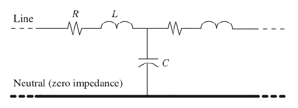
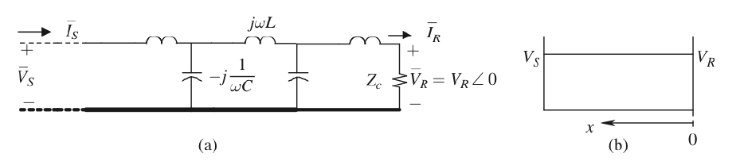
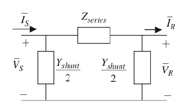
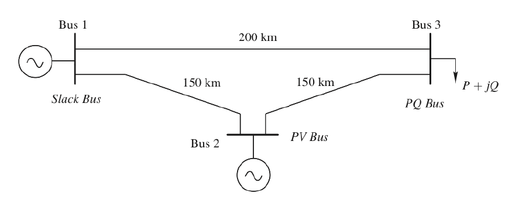
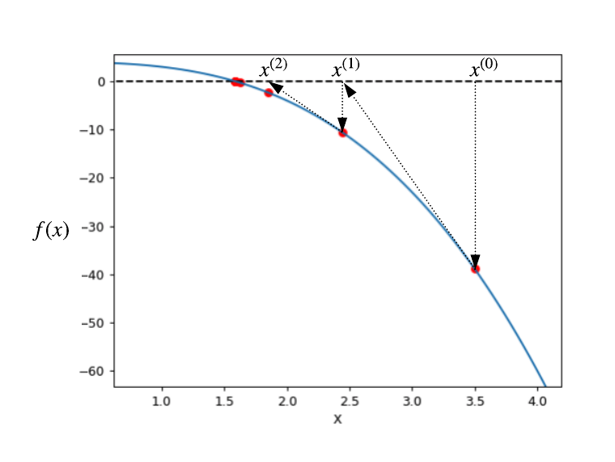

class: middle, center, title-slide
count: false

# Analysis of electric power and energy systems

Lecture 3: The transmission line and power flow analysis part 1.

  

Bertrand Cornélusse 
[bertrand.cornelusse@uliege.be](mailto:bertrand.cornelusse@uliege.be)

---

# What will we learn today?

- The transmission line
- An introduction to power flow analysis

You will be able to do exercises ... from the Ned Mohan's book.

---

class: middle

# The transmission line

---

class: middle, center, black-slide

<iframe width="600" height="450" src="https://www.youtube.com/embed/R_Z-A9KZr58" frameborder="0"  allowfullscreen></iframe>

---

## Definition

- An (overhead) transmission line is a set of 3 bundles of conductors corresponding to the three phases of the system.
- Commonly used voltages range from 70 kV to 380 kV in Belgium (more where distances are larger).
- Minimum distances between conductors depend of the voltage level, and thus electrical properties also depend on the voltage level.
- Cables are more and more used. They have different properties but we will not enter in the details in this course.

---

class: middle, center

## A part of ELIA's network

.center[.width-100[]]

Source: https://www.elia.be/fr/infrastructure-et-projets/nos-infrastructures

---

## Transmission line parameters

A *chunk* of line can be represented as 
.center[.width-80[]]
where
 - $R$ represents the series resistance, as small as possible to minimize $RI^2$ (influence of the frequency and skin effect)
 - the series inductance $L$  models the magnetic coupling between phases
 - the shunt capacitance $C$  models the capacitive coupling between phases
 - a shunt conductance $G$ can be added to model e.g. the leakage current through insulators

---
class: middle 

.center[.width-80[]]

---

## Distributed parameter representation in sinusoidal steady state

On a per phase basis:

.center[.width-80[]]

How do voltage and current evolve as a function of the position on the line?
- As $R$ is small, let's assume $R$ is considered as *lumped*.
- $$$\frac{d\bar{V}(x)}{dx} = j\omega L \bar{I}(x)$
- $$$\frac{d\bar{I}(x)}{dx} = j\omega C \bar{V}(x)$

---

Hence $$\frac{d^2\bar{V}(x)}{dx^2} + \beta^2 \bar{V}(x) = 0$$ 
 - which yields $\bar{V}(x) = \bar{V}\_1 e^{\beta j x} + \bar{V}\_2 e^{-\beta j x}$
 - and by derivation $\bar{I}(x) = (\bar{V}\_1 e^{\beta j x} - \bar{V}\_2 e^{-\beta j x}) / Z_c$

Whith 
 - $\beta = \omega \sqrt{LC}$ the *propagation constant*
 - $Z_c = \sqrt{\frac{L}{C}} $ the *surge impedance*

Boundary conditions at $x=0$ allow to determine constants $\bar{V}\_1$ and $\bar{V}\_2$, and finally 
$$\bar{V}(x) = \bar{V}\_R \cos(\beta x) + j Z_c \bar{I}\_R sin(\beta x)$$

---

## Surge impedance loading

If the line is assumed lossless and we close it with $Z_c$, assuming $\bar{V}\_R = V_R \angle 0$:
.center[.width-100[]]
then the voltage magnitude is constant over the line: $\bar{V}(x) = V_R e^{j\beta x}$, and only the angle increases with $x$.
Similar conclusion for $\bar{I}(x)$.

Why? The reactive power consumed by the line is the same as the reactive power produced, everywhere.

The surge impedance loading is the power drawn by the load $Z\_c$, which depends on the voltage level $V\_{LL}$
$$SIL = \frac{V_{LL}}{Z_c}$$
Example: for $500 kV$, $SIL \approx 1020 MW$

---

## Line loadability

The SIL gives and idea of the loadability of a line depending on its length: 
 - short line, $ l < 100 km$ 
  - load limit $= 3 \times SIL$ 
  - thermal limit
 - Medium length line, $ 100 km < l < 300 km$
  - load limit $= 1.5$ to $3 \times SIL$ 
  - voltage drop < 5%
 - Long line, $ l > 300 km$
  - load limit $\approx 1 \times SIL$ 
  - for system stability, the angle difference between line ends should stay < 40°, see future lesson

---

## Lumped transmission line model in steady state aka *the $\pi$ model*

If $l$ is relatively small ($< 300 kM$), we can approximate the line with lumped parameters: 
.center[.width-60[]]
with $Z\_{series} = R l +  j \omega L l$ and $\frac{Y\_{shunt}}{2} = j \frac{\omega C l}{2}$,
(remember that $R$, $L$ and $C$ are per km values).

This $\pi$ model is symmetrical by design.

---

class: middle, center, black-slide

<iframe width="600" height="450" src="https://www.youtube.com/embed/pzYvDuvM5JY" frameborder="0"  allowfullscreen></iframe>

---

class: middle

# Power flow analysis

---

## What is a power flow analysis?

Power flow (or load flow) analysis is about determining the electrical state of a system, when information about power generated or consumed is available at nodes of the network, and considering that the voltage level is regulated at some buses.

This type of analysis is commonly used by power companies for planning and operation purposes. 

If voltage magnitude and angles were measured at all buses, then it would boil down to solving a set of simple linear equations. 
In a similar way, mesh or nodal analysis could be used if we had a full model of the system, even without all voltage measurements. 
But here the situation is different, because we mainly have access to *power* measurements. The system is no more linear.

---

## SCADA systems: a note about measurement and communication 

SCADA means "supervisory control and data aquisition". This video defines a number of terms that are commonly used.

.center[<iframe width="600" height="450" src="https://www.youtube.com/embed/nlFM1q9QPJw" frameborder="0"  allowfullscreen></iframe>]

---

## Power flow problem statement

Determine **the voltage at every bus**, assuming we have a power system composed of transmission lines connecting the following bus types:
 - *PQ buses* are typically loads where active and reactive power are measured
  - it can also be generation where voltage is not regulated (e.g. renewable generation)
 - *PV buses* where the active power and the voltage are specified
  - these are typically generators
 - one *slack bus* that sets the reference for the voltage magnitudes and angles (it is usually at 1 pu)
  - P and Q can take any value to reach the power balance in the system.

Branch currents and losses can be determined from the voltages (magnitudes and phases).

Note: as we will see, PV buses must be swithed to PQ buses in case they reach a limit of their capability curve.

---

## A first tiny example

.center[.width-80[]]

.grid[
.kol-1-2[Buses: 
 - Bus 1 is the slack, with V = 1 pu
 - Bus 2 is a PV bus, with V regulated at 1.05 pu and drawing P= 2 pu
 - Bus 3 is a PQ bus, consumes P = 5 pu and Q = 1 pu.]
.kol-1-2[Lines: 
 - X = 0.376 Ohm/km (at 60 Hz)
 - R = 0.037 Ohm/km
 - Shunt susceptances are ignored (4.5e-6 S/km)]]

Voltage base (3-phase): 345 kV, 
Power base (3-phase): 100 MVA

---

## Result of the tiny example using pandapower

[Link to the Python notebook](notebooks/first_PF_pandapower.ipynb)

|    |   vm_pu |   va_degree |    p_mw |   q_mvar |
|---:|--------:|------------:|--------:|---------:|
|  0 |    1.00 |        0.00 | -308.38 |    81.61 |
|  1 |    1.05 |       -2.07 | -200.00 |  -266.74 |
|  2 |    0.98 |       -8.79 |  500.00 |   100.00 |

Are there losses?

--

Results for the lines:

|    |   p_from_mw |   q_from_mvar |   p_to_mw |   q_to_mvar |   pl_mw |   ql_mvar |   i_from_ka |   i_to_ka |
|---:|------------:|--------------:|----------:|------------:|--------:|----------:|------------:|----------:|
|  0 |       68.99 |       -110.87 |    -68.20 |      118.95 |    0.80 |      8.08 |        0.22 |      0.22 |
|  1 |      268.20 |        147.79 |   -264.23 |     -107.49 |    3.97 |     40.30 |        0.49 |      0.49 |
|  2 |     -235.77 |          7.49 |    239.38 |       29.26 |    3.62 |     36.75 |        0.40 |      0.40 |

---

# The power flow equations

 - Let $\mathcal{N}$ be the set of buses of the network
 - Some buses are interconnected by transmission lines, given by their $\pi$ models
 - Let $Y\_{kG}$ be the sum of admittances connected between node $k$ and the ground: 
  - the shunt admittances of the lines incident to $k$, and the admittances of the devices connected at node $k$ if any.
 - For two nodes $k$ and $m$, let $Z\_{km}$ be the series impedance of the line connecting them ($Z\_{km} = 0 \Omega$ if there is no line), and $Y\_{km} = Z\_{km}^{-1}$

The current injection at node $k$ is 
 $$\bar{I}\_k = Y\_{kG} \bar{V}\_k + \sum\_{m \in \mathcal{N} \setminus k} {\frac{\bar{V}\_k - \bar{V}\_m } {Z_{km}}} $$

---

This last equation can be rewritten as 
$$\bar{I}\_k =  \bar{V}\_k \left(Y\_{kG}+ \sum\_{m \in \mathcal{N} \setminus k} Z\_{km}^{-1} \right) - \sum\_{m \in \mathcal{N} \setminus k} {\frac{\bar{V}\_m } {Z_{km}}} $$

which highlights the possibility to write in matrix form 

$$ \mathbf{\bar{I}} = \mathbf{Y} \mathbf{\bar{V}}$$ 

with $\mathbf{\bar{I}}$ and $\mathbf{\bar{V}}$ the vectors of bus current injections and bus voltages, respectively.

  

The *admittance matrix* $\mathbf{Y}$ can be determined by inspection: 
 - Element $y\_{kk}$ is the sum of the admittances incident to bus $k$
 - Element $y\_{km}, m \neq k$, is the opposite of the sum of the admittances connecting bus $k$ to bus $m$

---

But remember that we have power and voltage measurements. So we can derive 

$$\begin{aligned} 
\mathbf{P} +j \mathbf{Q} &= \mathbf{\bar{V}} \circ \mathbf{\bar{I}}^{\star} \\\\ 
&= \mathbf{\bar{V}} \circ \mathbf{Y}^{\star} \mathbf{\bar{V}}^{\star}
\end{aligned}$$
where $P$ and $Q$ are the vectors of active and reactive power injections, respectively, and $\circ$ denotes the elementwise product. 

If we develop this relation for a node $k$, we have:
$$\begin{aligned}
P\_k &= G\_{kk} V\_k^2  & + V\_k \sum\_{m \in \mathcal{N} \setminus k} V\_m(G\_{km} \cos\theta\_{km} + B\_{km} \sin\theta\_{km}) & = p\_k(\mathbf{\bar{V}}) \\\\
Q\_k &= -B\_{kk} V\_k^2 & + V\_k \sum\_{m \in \mathcal{N} \setminus k} V\_m(G\_{km} \sin\theta\_{km} - B\_{km} \cos\theta\_{km}) &= q\_k(\mathbf{\bar{V}})
\end{aligned}$$
with 
 - $Y\_{km} = G\_{km} + j B\_{km}$ 
 - $Y\_{kk} = G\_{kk} + j B\_{kk}$ is the sum of the admittances from bus $k$ to ground
 - $\theta\_{km} = \theta\_{k} - \theta\_{m}$ the phase difference between voltages at nodes $k$ and $m$

---

## Number of equations and unknowns
If there are $n$ buses in total, among which $n\_{PQ}$ PQ buses, $n\_{PV}$ PV buses and one slack bus, hence
$$n = n\_{PQ} + n\_{PV} + 1,$$
then 
 - $\mathbf{P}$ is known for $n\_{PQ} + n\_{PV}$ buses (all but the slack)
 - Elements of $\mathbf{Q}$ are known for the $n_{PQ}$ PQ buses
 - Voltage magnitude is known at PV buses and at the slack bus
 - Voltage angle is known at the slack bus.

  

In total, there are $2n$ equations for $2n$ unknowns: $n-1$ voltage angles, $n\_{PQ}$ voltage magnitudes, $n\_{PV} + 1$ reactive powers, and 1 active power.

---

# Power flow solution method

Let 
 - $\mathbf{P}^0$ be the active powers specified at the $\mathcal{N}\_{PQ} \cup \mathcal{N}\_{PV}$ buses
 - $\mathbf{Q}^0$ be the reactive powers specified at the $\mathcal{N}\_{PQ}$ buses.

To find $\mathbf{\bar{V}}$, we must solve 
$$\begin{aligned}
P\_k^0 - p\_k(\mathbf{\bar{V}}) &= 0, \ \forall k \in \mathcal{N}\_{PQ} \cup \mathcal{N}\_{PV} \\\\
Q\_k^0 - q\_k(\mathbf{\bar{V}}) &= 0, \ \forall k \in \mathcal{N}\_{PQ}
\end{aligned}$$
which is a set of $2 n\_{PQ} + n\_{PV}$ non-linear equations.

The most widespread method to solve this system is the *Newton-Raphson method*.

---

## Newton-Raphson example in 1D

 - Let's assume we want to solve $c-f(x) = 0$ with $f$ a non-linear function.
 - We start with a first guess for $x$, $x^{(0)}$, at iteration $i=0$
 - Then, while $|c-f(x^{(i)})| > \epsilon$:
   - $x^{(i+1)} = x^{(i)} + \frac{c-f(x^{(i)})}{f'(x^{(i)})}$
   - $i \leftarrow i + 1$ 

For $c=4$ and $f(x) = x^3$ ([Link to the Python notebook](notebooks/first_PF_pandapower.ipynb)): 
.center[.width-50[]]

The *convergence is quadratic* if we start with x(0) "close” to the solution.

---

## Newton-Raphson for the power flow problem

We apply exactly the same idea to our problem, except that we are in dimension $2 n\_{PQ} + n\_{PV}$. 

Hence we must compute partial derivatives to compute the update steps:
$$\mathbf{\bar{V}}^{(i+1)}\_x = \mathbf{\bar{V}}^{(i)}\_x + \underbrace{\left[\mathbf{J}(\mathbf{\bar{V}}^{(i)})\right]^{-1} (\mathbf{F}^0-\mathbf{f}(\mathbf{\bar{V}}^{(i)}))}\_{\Delta \mathbf{\bar{V}}\_x}$$
where
 - $\mathbf{F}^0$ gathers the measured active powers at buses in $\mathcal{N}\_{PQ} \cup \mathcal{N}\_{PV}$ and reactive powers at buses $\mathcal{N}\_{PQ}$
 - $\mathbf{f}(\mathbf{\bar{V}})$ gathers the active and power flow equations at the corresponding buses
 - $\mathbf{\bar{V}}\_x$ is the subvector of $\mathbf{\bar{V}}$ that gathers the unknwon voltage magnitudes and angles at the the corresponding buses
 - $\mathbf{J}(\mathbf{\bar{V}})$ is the jacobian of $\mathbf{f}$, of size $(2 n\_{PQ} + n\_{PV}) \times (2 n\_{PQ} + n\_{PV})$

---

## Remarks

 - In practice, instead of computing the inverse of the Jacobian, we solve the system 
$$\mathbf{J}(\mathbf{\bar{V}}^{(i)}) \Delta \mathbf{\bar{V}}\_x = \mathbf{F}^0-\mathbf{f}(\mathbf{\bar{V}}^{(i)})$$ to get the update step
 - The Jacobian is often sparse, since a bus is connected to a few neighbors; it is very important to take into account the sparsity properties in practical implementations
 - The Jacobian is not necessarily updated at every iteration, especially close to convergence

---

## Fast decoupled power flow

Remember that 
- active power flow is mostly a function of voltage angles
- reactive power flow is mostly a function of voltage magnitudes

If we apply these ideas stricly, we can subdivide the problem in two much simpler subproblems:
 - one problem for angles, based on the active power measurements and the sub-Jacobian containing the partial derivatives of the active power flow equations w.r.t. angles
 - one problem for magnitudes, based on the reactive power measurements and the sub-Jacobian containing the partial derivatives of the reactive power flow equations w.r.t. magnitudes

This procedure, through the sub-Jacobian that are computed, also provide information useful for *sensitivity analysis*.

---

## DC power flow

"Direct Current" power flow is a further simplification:
 - it is assumed that the impact of the reactance of lines is much bigger than the impact of their resistance, and shunt conductances are neglected
 - voltage magnitudes are assumed equal to $1 pu$ 
 - angle differences are small
 - active power losses are neglected, reactive power flows as well
 
$$P\_k =  \sum\_{m \in \mathcal{N} \setminus k} B\_{km} \theta\_{km} $$ for every bus but the slack bus, which sets the angle difference, and collects the algebraic sum of all other injected powers.

In matrix form, with $\mathbf{Y}$ the admittance matrix defined before: 
$$\mathbf{P} =  \Im(\mathbf{Y}) \mathbf{\theta}$$

This is usefull for fast simulations, or when including a power flow model in an optimization problem, e.g. [day-ahead market coupling](https://bcornelusse.github.io/material/CoursEM20170331.pdf).

---

# References

- Mohan, Ned. Electric power systems: a first course. John Wiley & Sons, 2012.
- Course notes of ELEC0014 by Pr. Thierry Van Cutsem.
- L. Thurner, A. Scheidler, F. Schäfer et al, pandapower - an Open Source Python Tool for Convenient Modeling, Analysis and Optimization of Electric Power Systems, in IEEE Transactions on Power Systems, vol. 33, no. 6, pp. 6510-6521, Nov. 2018.

---

class: end-slide, center
count: false

The end.
