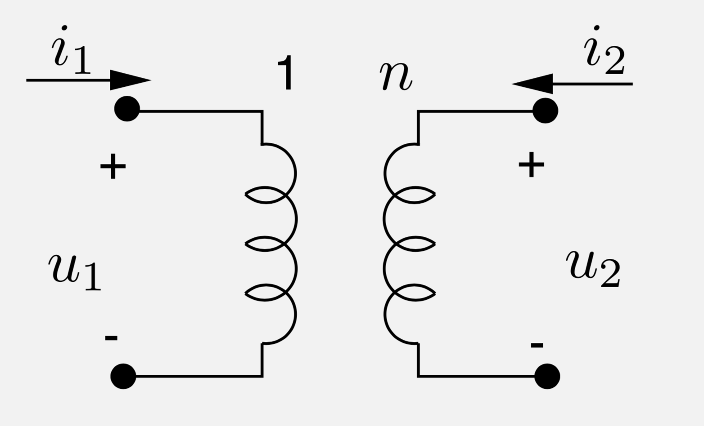
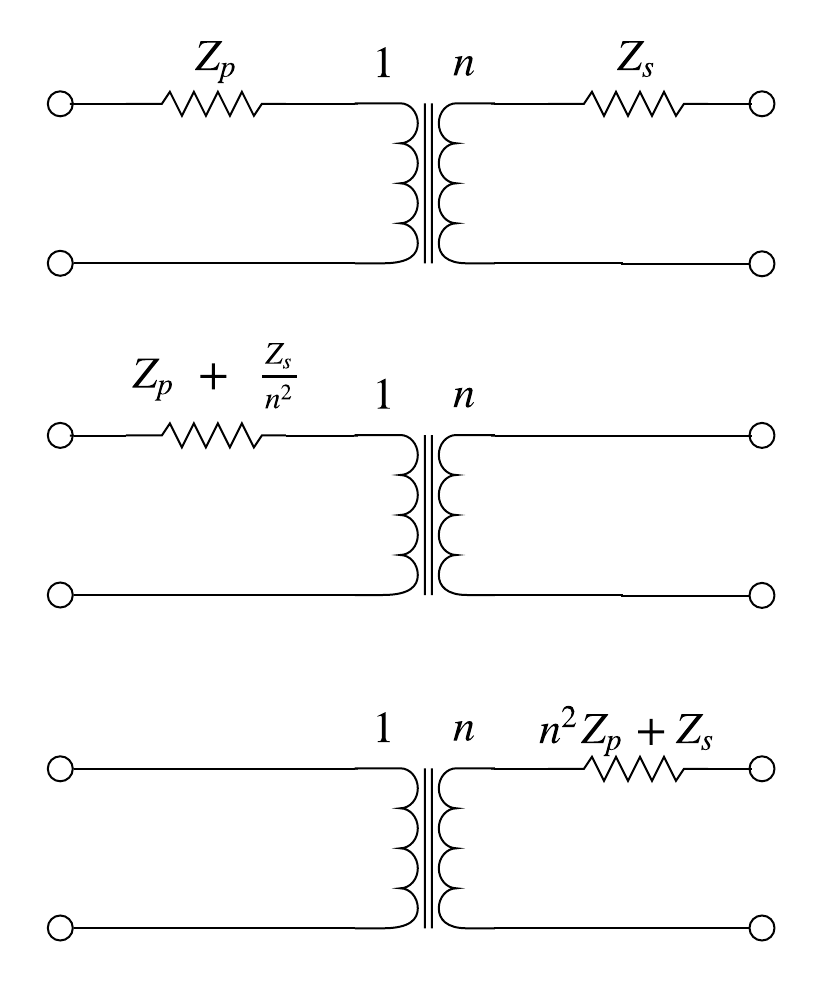
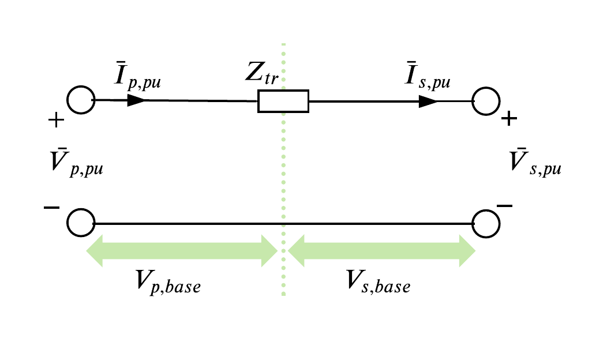
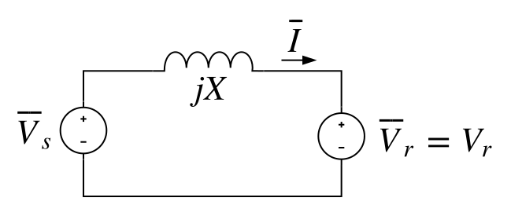

class: middle, center, title-slide
count: false

# Analysis of electric power and energy systems

Lecture 4: Transformers, power flow analysis part 2

  

Bertrand Cornélusse 
[bertrand.cornelusse@uliege.be](mailto:bertrand.cornelusse@uliege.be)

---

# What will we learn today?

- The power transformer
- The next part of power flow analysis: how to include transformers, and transformers with tap changers

You will be able to do exercises 6.2, 6.3, 6.4 from the Ned Mohan's book.

---

class: middle

# The transformer

---

A (single phase) transformer is made of two magnetically coupled *coils* or *windings*. An ideal transformer is a two-port represented as 

.grid[
.kol-1-2[.width-80[]]
.kol-1-2[
with
$$u\_2  = n u\_1$$ 
$$i\_2  = -\frac{1}{n}i\_1$$
]]

In power systems, transformers are mainly used to transmit power over long distances by changing the voltage level, thus decreasing the current for a given power level. Voltage level of synchronous generator around 20kV.

Voltage is changed around 5 times between generation and load.

It is also used to *measure* currents and voltages, electrically *isolate* parts of a circuit (not the auto-transformer we will see), *match* impedances.

---

class: middle, center, black-slide

<iframe width="600" height="450" src="https://www.youtube.com/embed/vh_aCAHThTQ" frameborder="0" allowfullscreen></iframe>

---

## Non-ideal model

.center.width-90[]

The ideal model is complemented by elements 
- $X\_m$ that models the magnetizing inductance
- $X\_{leakage, i}$ that models the flux not captured by the core on side $i$
- $R\_{core}$ that models eddy current and hysteresis losses, i.e. losses in the iron core
- $R\_{1}$ and $R\_{2}$ that model (coil) copper losses

Parameters are either given in the datasheet or obtained by open-circuit and short-cirtuit tests.

Laminated core to decrease losses.

---

The excitation current, sum of the currents in $R\_{core}$ and $X\_m$, is often neglected, leading to a simpler non-ideal model, and the series impedances can be transferred from one side to the other:

.grid[
.kol-1-2[.center.width-90[]]
.kol-1-2[
with $$Z\_p = R\_1 + jX\_{leakage, 1}$$ and $$Z\_s = R\_2 + jX\_{leakage, 2}$$]]

---

## Per unit representation

Let's consider the rated voltages and currents on both sides of the (ideal) transformer as base values. As $$V\_{s, base} = n V\_{p, base} $$ and $$ I\_{p, base} = n I\_{s, base},$$
the *MVA base is the same on both sides*, and thus
$$Z\_{s, base} = n^2 Z\_{p, base}$$

.grid[
.kol-1-2[
Hence, *in per unit, the transformer can be replaced by a single impedance*  
$$Z\_{tr} = \frac{Z\_{p}}{Z\_{p, base}}+\frac{Z\_{s}}{Z\_{s, base}}.$$
]
.kol-1-2[
.center.width-100[]
]]
---

Thus we have also that $$\begin{aligned}Z\_{tr} &= \frac{Z\_{p}+ Z\_s/n^2}{Z\_{p, base}} \\\\ &= \frac{n^2 Z\_{p} + Z\_s}{Z\_{s, base}}\end{aligned}$$
i.e. *the impedance if the same whether we see it from the primary or the secondary side, although the voltage bases differ*.

Also, if the three-phase transformer is *wye-delta* connected, a *30° phase shift* must be applied (more on this later).

---

## Example 6.1

Consider the one-line diagram 

.width-90[]

with 
 - a 200 km line with $R = 0.029 \Omega/km$, $X=0.326 \Omega/km$, neglected shunt impedances
 - two ransformers with a leakage reactance of $0.2 pu$ in the (500 kV, 1000 MVA) base, and losses neglected.

*What is the equivalent model in a (345 kV, 100 MVA) base?*

---

### In the (500 kV, 1000 MVA) base:

- $Z\_{line, pu} = 200 \times (0.029 + j 0.326) / (500^2/1000) = 0.0232 + j 0.2608 pu$

- hence the total impedance between buses 1 and 2 is $$Z\_{12} = 0.0232 + j 0.2608  + 2 * j 0.2pu =  0.0232 + j 0.6608 pu $$

---

### In the (345 kV, 100 MVA) base:

- the pu value of the impedance is the same in the (*500* kV, 1000 MVA) and (**345** kV, 1000 MVA) bases, 
 - since we can transfer the impedance from one side of each transformer to the other, cf. a previous remark

- if we now change the MVA base to 100 MVA, 
 $$Z\_{12} = 0.0232 + j 0.6608  \times (100/1000) pu =  0.00232 + j 0.06608 pu$$ since the base impedance is proportional to the inverse of the MVA base.

---

## Efficiency

The efficiency expressed in % is 
$$100 \times \frac{P\_{output}}{P\_{input}} = 100 \times \left(1 - \frac{P\_{losses}}{P\_{input}}\right) $$

- maximal when copper losses = iron losses (cancel derivative of efficiency w.r.t current) 
- Around 99.5 % in large power transformers at full load.

---

## Tap changers

- Some transformers are equipped with a system allowing to change the $1:n$ ratio
- The ability to change the tap under load is called load tap changer (LTC) or on-load tap changer (OLTC)
- This is mainly used for voltage control
- It is usually implemented using auto-transformers
- We will see later on how to include this in the power flow analysis

---

class: middle, center, black-slide

<iframe width="600" height="450" src="https://www.youtube.com/embed/R_NxRDXOEFk" frameborder="0"  allowfullscreen></iframe>

---

## Auto-transformers

The two windings (of the same phase) are connected in series, without galvanic insulation. They are commonly used when the ratio is limited.

Advantages: 
- Physically smaller
- less costly (less copper)
- higher efficiency
- easy to implement tap changes
- "solid" earth grounding

Disadvantages:
- no electrical insulation
- higher short circuit current
- full voltage at secondary if it breaks (in case of a step down)

---

class: middle, center, black-slide

<iframe width="600" height="450" src="https://www.youtube.com/embed/lltVwhoPvh0" frameborder="0"  allowfullscreen></iframe>

---

## Phase shift in delta-star transformers

The star part has $n$ times the number of turns of the delta part (primary side).

Let's reason on phase $a$,
- Voltage $\bar{V}\_{a,s}$ is on the same core as $\bar{V}\_{AC,p} = \sqrt{3}\bar{V}\_{a,p} \angle{-30^\circ}$ where $\bar{V}\_{a,p}$ is the (virtual) phase-neutral voltage on the primary side.
- Since  $\bar{V}\_{a,s} = n \bar{V}\_{AC,p}$, $\bar{V}\_{a,s} = n\sqrt{3} \bar{V}\_{a,p} \angle{-30^\circ}$

.center.width-50[]

We *gain a $\sqrt{3}$ factor* in the amplification, but a *lagging phase shift of 30°*.

The same reasoning holds for phases $b$ and $c$.

---

## Power flow regulation by phase shifting

We have seen in [lecture 2](?p=lecture2.md#19) that active power flows are dictated by the voltage magnitudes but also the sine of the angle difference between buses: 
.grid[
.kol-1-2[
.center.width-100[]]
.kol-1-2[
$$\begin{aligned}
S\_r &= \bar{V}\_r\bar{I}^*  = V\_r \left(\frac{V\_s \angle -\delta - V\_r}{-jX}\right) \\\\
     &= \frac{V\_s V\_r \sin \delta }{X} +j \frac{V\_s V\_r \cos \delta - V^2\_r}{X} 
\end{aligned}$$
$\delta$ is the angle between $\bar{V}\_r$ and $\bar{V}\_s$]]

If we have a device that can generate an adjustable phase shift, we can control the power flows.
This is the purpose of *phase-shifting transformers*.

In practice phase shifting is achieved by "combining the signal with a fraction of itself shifted by 90°".
For the details of how it is implemented or modeled, see 
 - [Wikipedia](https://en.wikipedia.org/wiki/Quadrature_booster)
 - Section 5.7. of the Weedy or ELEC0014.
 - [ENTSO-E - Phase Shift Transformers Modelling, Version 1.0.0, May 2015](https://eepublicdownloads.blob.core.windows.net/public-cdn-container/clean-documents/CIM_documents/Grid_Model_CIM/ENTSOE_CGMES_v2.4.14_28May2014_PSTmodelling.pdf)

---

## Example: phase shifting transformers on the borders of Belgium
 
.center.width-50[]

380/380 kV : in series with:
1. line Zandvliet (B) - Borssele (NL) and Zandvliet (B) - Geertruidenberg (NL)
2. line Meerhout (B) - Maasbracht (NL)
3. line Gramme (B) - Maasbracht (NL)
 - nominal power 3VN Imax = 1400 MVA
 - phase shift adjustment: 35 positions, +17/-17 × 1.5° (at no load)

.footnote[From ELEC0014.]

---

.center.width-50[]

220/150 kV : 
 - in series with the Chooz (F) - Monceau (B) line nominal power: 400 MVA
 - in-phase adjustment : 21 positions, +10/-10 × 1.5 % 
 - quadrature adjustment: 21 positions, +10/-10 × 1.2°

.footnote[From ELEC0014.]

---

## Remarks

In *three-phase operation*,  
 - either there are three separate single-phase transformers (easier to fix when there is a problem on a phase, more modular)
 - or a *three-phase transformer*, that is a single core with three auto-transormers on it, cf. the video at the beginning of this presentation (cheaper, lighter core and less copper).

Some transformers called *three-winding transformers* are equiped with a third winding (not to be confused with a three-phase transformer) that is used for auxiliary purposes (feeding auxiliary devices e.g. fans, providing reactive power support, ...)

---

class: middle

# Transformers in the power flow analysis

---

## Transformer without regulation

A transfomer, in the per unit representation, can thus be represented 
 - as a two-port if the shunt admittance are considered
 - as a simple series leakage impedance if the shunt admittance is neglected

---

## Representing taps and phase shifts

Let $Y\_l$ be the leakage admittance and $t$ be the off-nominal turns ratio:
.grid[
.kol-1-2[
- if $ 0 < t \leq 1$, this corresponds to a simple tap-changer
- if $ 0 < |t| \leq 1$ but is complex, then this is a phase-shifter ($\angle{t} < \pi/2$)]
.kol-1-2[.center.width-90[]]]

We have 
$$\bar{I}\_1 = \left(\bar{V}\_1 - \frac{\bar{V}\_2}{t}\right) Y\_l$$
and since $\frac{\bar{V}\_2}{t} \bar{I}\_1^\star = -\bar{V}\_2 \bar{I}\_2^\star$ by energy conservation
$$\bar{I}\_2 = - \frac{\bar{I}\_1}{t^\star} = - \bar{V}\_1 \frac{Y\_l}{t^\star} + \bar{V}\_2 \frac{Y\_l}{|t|^2}$$

---

Thus tap and phase shift can be represented by the admittance matrix

$$\left[\begin{array}{c} \bar{I}\_1 \\\\ \bar{I}\_2\end{array}\right] 
 = \left[\begin{array}{c c} Y\_l & -\frac{Y\_l}{t} \\\\ -\frac{Y\_l}{t^\star} & \frac{Y\_l}{|t|^2} \end{array}\right]
 \left[\begin{array}{c} \bar{V}\_1 \\\\ \bar{V}\_2\end{array}\right]$$

- if $ 0 < t \leq 1$, this can be represented as a $\pi$ two-port
- if $ 0 < |t| \leq 1$ but is complex, this is not the case

In the [power flow analysis](?p=lecture3.md#23), you must **pay attention to this when contructing the system-wide admittance matrix.**

---

## Pandapower example

See [python notebook](https://colab.research.google.com/drive/1lwSYX5xFjlDnkD0J-6sFsNeRH2ryJV5p?usp=sharing) / video recording.

---

# References

- Mohan, Ned. Electric power systems: a first course. John Wiley & Sons, 2012. Chapter 6.
- Weedy, Birron Mathew, et al. Electric power systems. John Wiley & Sons, 2012. Section 3.8, Section 5.7.
- [Course notes of ELEC0014](https://people.montefiore.uliege.be/vct/courses.html) by Pr. Thierry Van Cutsem.

 
---

class: end-slide, center
count: false

The end.
