class: middle, center, title-slide
count: false

# Analysis of electric power and energy systems

Lecture 5: Synchronous generators

  

Bertrand Cornélusse 
[bertrand.cornelusse@uliege.be](mailto:bertrand.cornelusse@uliege.be)

---

# What will we learn today?

- What are synchronous generators
- How we can model them for our analyses
- How to include generator limits in power flow computation.

You will be able to do exercises 9.5 to 9.9 of Ned Mohan's book.

---

class: middle

# Principle

---

## Synchronous machines

Synchronous machines produce the major part of the electric energy
 - range from a few kVA to a few hundred MVA 
 - the biggest are rated 1500 MVA

They play other important roles:
 - they impose the frequency of sinusoidal voltages and currents
 - they provide an “energy buffer” (through the kinetic energy stored in their rotating masses)
 - they can produce or consume reactive power (needed to regulate voltage).

---

class: middle, center, black-slide

<iframe width="600" height="450" src="https://www.youtube.com/embed/8XF-11MQGQ0?list=PLuUdFsbOK_8qVROrfl2M2WSV2xAz-ABVU" frameborder="0" allowfullscreen></iframe>

Magnetic field created by the stator

---

## Magnetic field created by the stator

-   stator (or *armature*) = motionless, separated from the rotor by a
    small air gap

-   subjected to varying magnetic flux ⇒ built up of thin laminations to
    decrease *eddy (or Foucault)* currents

-   equipped with three windings, distributed 120 degrees apart in
    space.

 
Magnetic field created by a direct current flowing in one of the stator
windings:

.center.width-50[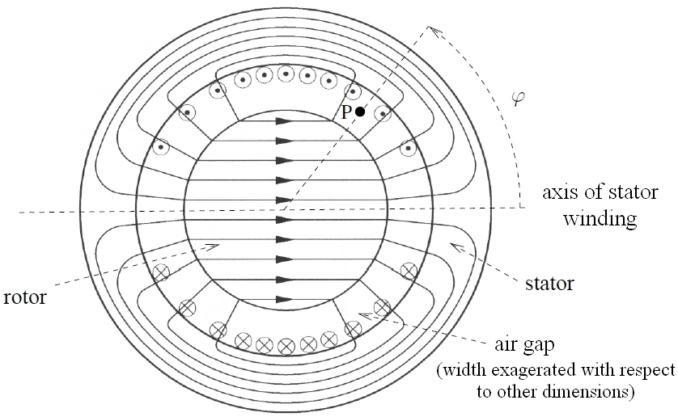]

---

The magnetic field lines cross the air gap radially.

The amplitude $B(\varphi)$ of the magnetic flux density at point P :

-   is a periodic function of $\varphi$ with period $2\pi$

-   this function has a “staircase” shape

-   is made as close as possible to a sinusoid, by properly distributing
    the conductors along the air gap.

 

Layout of the three phases (each winding represented by a single turn for clarity):

.center.width-30[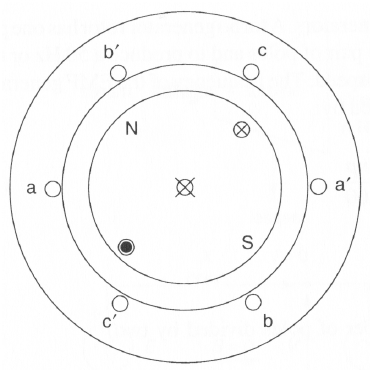]

---

Total flux density created by the three phases at point P corresponding to angle $\varphi$:

$$B\_{3 \\phi}(\\varphi) = k i\_a \\cos \\varphi + k i\_b \\cos(\\varphi - \\frac{2
\\pi}{3}) + k i\_c \\cos(\\varphi - \\frac{4 \\pi}{3})$$

If three-phase alternating currents are flowing in the windings:

$$B\_{3 \\phi}(\\varphi) = \frac{3 \sqrt{2} k I}{2}  \cos(\omega t + \psi - \varphi)$$

The three-phase alternating currents all together produce the same
magnetic field as a magnet (or a coil carrying a direct current)
rotating at the angular speed $\omega$

 - North pole of magnet ≡ maximum of $B(\varphi)$
 - South pole of magnet ≡ minimum of $B(\varphi)$

---

class: middle, center, black-slide

<iframe width="600" height="450" src="https://www.youtube.com/embed/tiKH48EMgKE?list=PLuUdFsbOK_8qVROrfl2M2WSV2xAz-ABVU" frameborder="0"  allowfullscreen></iframe>

Magnetic field created by the rotor

---

## Magnetic field created by the rotor

-   rotor = rotating part, separated from the stator by the air gap
-   carries a winding in which a direct current flows, in steady-state operation
-   referred to as *field* winding (in French: enroulement d'excitation)

 

Magnetic field created by this direct current (field winding represented by a single turn for clarity)
:

.center.width-50[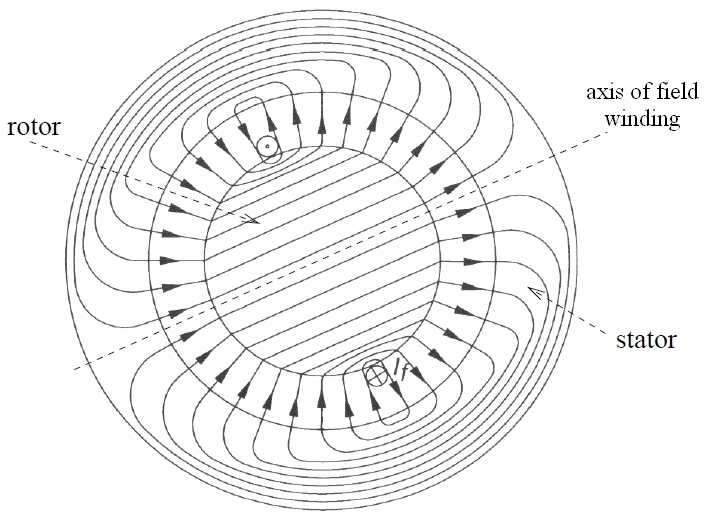]

---

## Interaction between magnetic fields and electromechanical conversion

-   In a synchronous machine, in steady state, the rotor rotates at the
    same angular speed $\omega$ as the magnetic field produced by the stator
-   thus, the stator and rotor magnetic fields are fixed with respect to
    each other
-   both fields tend to align in the manner of two magnets
-   if one pulls apart those two magnets, an electromagnetic torque
    appears.

Mechanical analogy:

.center.width-50[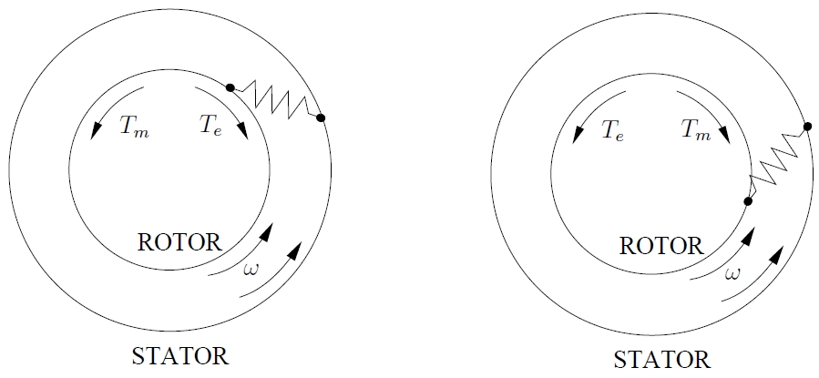]

.center[generator operation <-> motor operation]

There exists a max value of the electromagnetic torque $T\_e$ $\; \rightarrow \;$ loss of synchronism

---

class: middle, center 

# The two types of synchronous machines

---

## Machines with multiple pairs of poles

Some turbines operate at a lower speed, but AC voltages and currents at the stator must keep the same period $T=\\frac{1}{f}$

.grid[
.kol-1-2[
-   the rotor carries $p$ pairs of poles
-   during a period $T$, the rotor makes only $\frac{1}{p}$ of a whole revolution
-   the stator carries $p$ sets of (a, b, c) windings
-   one winding spans an angle of $\frac{\pi}{p}$  radians
-   during a period $T$, each stator winding is still swept by one North and one South pole of rotor.
]
.kol-1-2[
.center.width-60[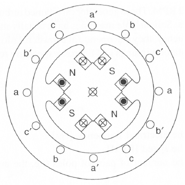]
.center[example: $p=2$ ]
]]

---

## Machines with multiple pairs of poles (...)

Speed: $\\displaystyle \\frac{3000}{p}$ rev/min at 50 Hz

The various windings relative to a given phase are connected (in series
or parallel) to end up with a three-phase machine.

**Caution**: $p$ sometimes denotes the number of poles, sometimes the number of pairs of poles.

---

## Round-rotor generators (or turbo-alternators)

.center.width-80[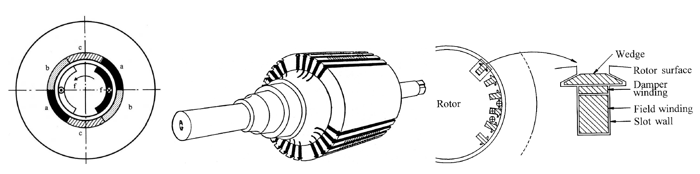]

Driven by steam or gas turbines, which rotate at high speed

-   $p=1$ (conventional thermal units)   or   $p=2$ (nuclear units)

-   cylindrical rotor made up of solid steel forging

-   diameter  << length (centrifugal force !)

-   field winding made up of conductors distributed on the rotor, in
    milled slots

-   even if the generator efficiency is around 99 %, the heat produced
    by Joule losses has to be evacuated !  Large generators are cooled by hydrogen (heat evacuation 7 times
    better than air) or water (12 times better) flowing in the hollow
    stator conductors.
---

## Salient-pole generators

.center.width-70[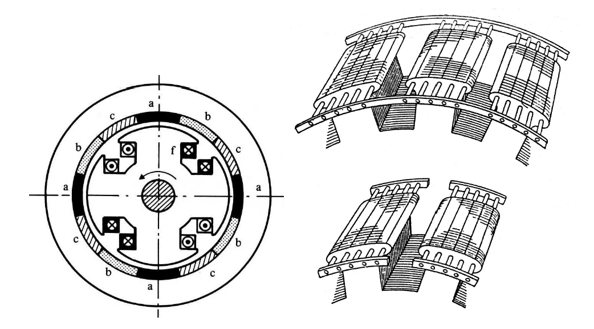]

-   Driven by hydraulic turbines (or diesel engines), which rotate at
    low speed

-   $p$ is much higher (at least 4)  ⇒  it is more convenient to have
    field windings concentrated and placed on the poles

-   diameter  >>  length (to have space for the many poles)

-   rotor is laminated (poles easier to construct)

-   generators usually cooled by the flow of air around the rotor.

---

## Damper windings (or amortisseurs)

-   round-rotor machines: copper/brass bars placed in the same slots at
    the field winding, and interconnected to form a damper cage (similar
    to the squirrel cage of an induction motor)

-   salient-pole machines: copper/brass rods embedded in the poles and
    connected at their ends to rings or segments.

Why?

-   in perfect steady state: the magnetic fields produced by both the
    stator and the rotor are fixed relative to the rotor ⇒ no current
    induced in dampers

-   after a disturbance: the rotor moves with respect to stator magnetic
    field  
    ⇒ currents are induced in the dampers…  
    ... which, according to Lenz’s law, create a *damping torque* helping
    the rotor to align on the stator magnetic field.

 

Remark: in round-rotor generators: the solid rotor offers a path for eddy currents,
which produce an effect similar to those of dampers.

---

class: middle

# Model

---

## Induced emf in the stator windings

There are two sources that induce an *emf* (electromotive force) in the stator windings. 

 - the effect of the rotor's induced field ($\bar{E}\_{af}$)
 - the effect of the current flowing in the stator itself, called the armature reaction ($- j X\_s \bar{I}\_a$).

By superimposing them, we get the resulting emf.

We assume there is no magnetic saturation.

---

## Per phase equivalent circuit (for phase $a$)

.center.width-50[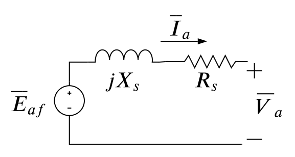]
- $R\_s$ is the resistance of a phase
- the *synchronous reactance* $X\_s$ characterizes the *steady-state operation* of the machine (magnetizing + leakage reactances)
- $\delta$, the phase shift between the internal emf $\bar{E}\_{af}$ and the terminal voltage $\bar{V}\_a$,  is called the *internal angle* or *load angle* of the machine.

.footnote[See [sourse notes of ELEC0431](https://people.montefiore.uliege.be/geuzaine/ELEC0431/3_Synchronous.pdf) for more details.]

We thus have 
$$\bar{V}\_a = \bar{E}\_{af} - R\_s \bar{I}\_a - j X\_s \bar{I}\_a$$

---
## Phasor diagram representation

.center.width-70[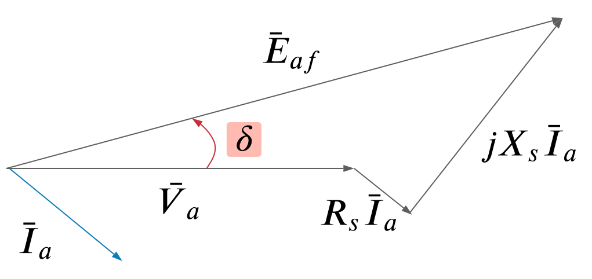]

---

## Machine parameters in per unit on the machine base

$R\_s \approx 0.005$ pu

$X\_s \in [1.5, 2.5]$ pu (for a round-rotor machine as considered in this lecture)

---

## Remark: models for other types of analysis

So far we are mostly interested in steady-state.

But note that depending on the type of analysis carried out, the model used should be adapted: 
- *Subtransient condition* (e.g. just after a short circuit fault): $X''\_s << X\_s$
- *transient state* (after the subtransient condition, before steady state):  $X'\_s < X\_s$ but $X''\_s < X'\_s$

Hence: 

$$X''\_s < X'\_s < X\_s$$

The field induced emf has to be adapted as well depending on the type of analysis.

---

class: middle, center

# Properties of the model

---

## Power output, stability, and loss of synchronism

Suppose a generator is connected to an external grid (imposing $\bar{V}\_\infty = V\_\infty$) through a transmission line. 

.center.width-80[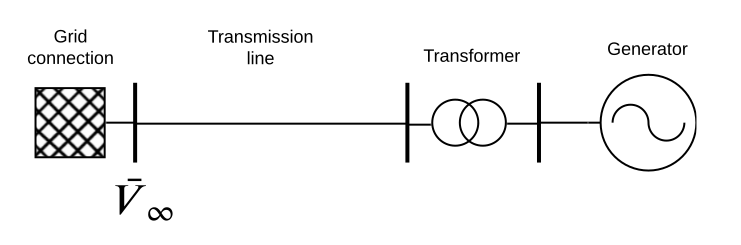]

Let $X\_T$ model the total reactance resulting from the reactance of the line, the reactance of the transformer, and the synchronous reactance of the machine. We neglect resistances.

The three phase active power delivered by the generator is (see [lecture 2](?p=lecture2.md#19)) 
$$ P = \frac{E\_{af}{V}\_\infty}{X\_T} \sin \delta$$

---

## About the internal angle $\delta$

The angle $\delta$ 
- is the angle between $\bar{E}\_{af}$ and $\bar{V}\_\infty$
- is positive in generator mode
- is a measure of the angular displacement of the rotor with respect to the synchronously rotating reference axis

If the field current is constant, $E\_{af}$ is constant. Then the power of the generator is proportional to $\sin \delta$.

There are **limits** on the value of $\delta$.

---

## Steady state stability limit

.center.width-90[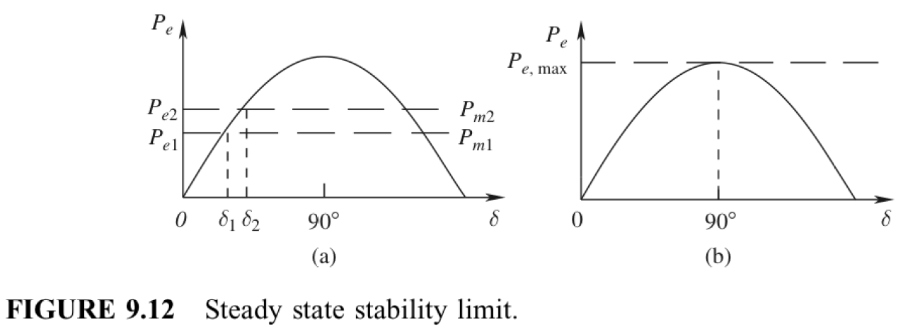]

Above $\delta = 90^\circ$ (maximum power generated), the synchronism is lost:
 - more mechanical power, less electrical power $\Rightarrow$ increase of $\delta$ $\Rightarrow$ too high currents

In practive the limit is well below, at around $\delta = 40^\circ$

---

## Adjusting reactive power 

We take the previous example and we want 
 - *to keep the same active power generation*
 - to adjust the reactive power generated or absorbed

Initially, assume the field current is adjusted to have a unitary power factor (case 1)

.center.width-100[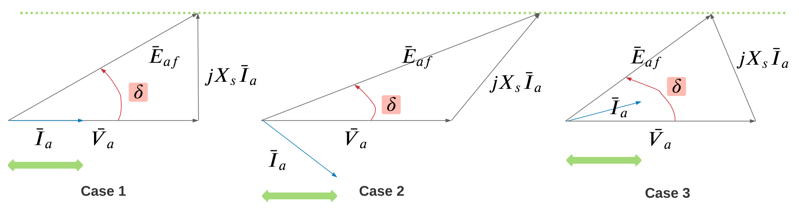]

What can we do?

--

By controlling the field current, it is possible to control the induced emf and the reactive power delivered (or absorbed).

---

## Overexcitation (case 2)

- Increasing the field current will increase $E\_{af}$ (no magnetic saturation)
- But $E\_{af} \sin \delta$ must stay the same, and $I\_a \cos \phi$ as well
- $\bar{I}\_a$ is lagging behind $\bar{V}\_a$
- The grid absorbs the reactive power
$$Q = 3 V\_a I\_a \sin \phi$$
- The generator behaves like a capacitor

---

## Underexcitation (case 3)

- Decreasing the field current will decrease $E\_{af}$
- But $E\_{af} \sin \delta$ must stay the same, and $I\_a \cos \phi$ as well
- $\bar{I}\_a$ is leading $\bar{V}\_a$
- The generator absorbs the reactive power
$$Q = - 3 V\_a I\_a \sin \phi$$
- The generator behaves like an inductor

---

## Remarks:

- This is the basic principle behind automatic voltage regulation
- Devices called "synchronous condensers" are synchronous machines used solely for voltage regulation (they consume active power from the grid).

---

## Capability curves

Seen from the network, a generator is characterized by three variables: $V$, $P$ et $Q$

The *capability curves* define the set of admissible operating points in the  $(P, Q)$ space, 
**under constant voltage $V$** (justified by automatic voltage regulator) 

.center.width-80[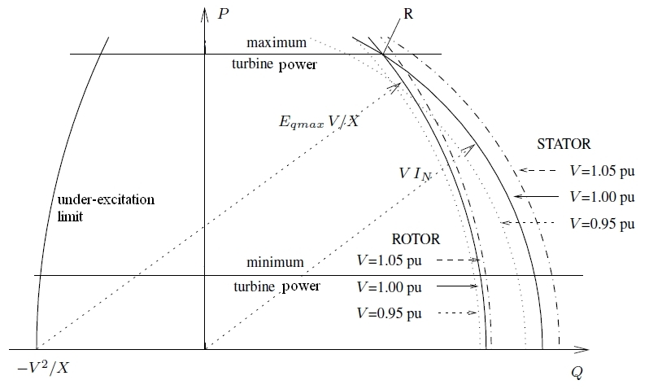]

---

## Explanation of limits

-   Lower limit on active power caused by stability of combustion in
    thermal power plants

-   maximum reactive power *in*creases when the active power
    *de*creases

    -   to relieve an overloaded machine, $P$ can be decreased but this
        power has to be produced by some other generators !

-   for a given value of $P$, the maximum reactive power increases with
    $V$

    -   this holds true under the simplifying assumption of a non
        saturated machine

-   in practice, under $V=1$ pu, the two-by-two intersection points of
    respectively the turbine, the rotor and the stator limits are close
    to each other ("coherent" design of stator and rotor)

- Under-excitation limit 
    - Corresponds to a stability, not a thermal limit: absorbing more $Q$
$\Rightarrow$ decreasing $E_{af}$ $\Rightarrow$ decreasing field current
$\rightarrow$ maximum torque $T_e$ decreases $\Rightarrow$ risk of
losing synchronism (see course on voltage regulation).

---

class: middle

# Synchronous generators in the power flow analysis

---

## Reaching the bus var limit

Given what we have established, this is straightforward:

 - Implement the bounds of the capability curves in the power flow tool
  - How would you do this? 
 - Solve assuming generators regulate $P$ and $V$ $\Rightarrow$ *PV bus*
 - If a boundary of the capability domain is reached
  - switch the generator to a *PQ bus* with the same *P* but the binding *Q*
  - solve the power flow again

This may require iterations, since other generators could need a switch.

.footnote[See section 5.10 of the book]

---

## Example with PandaPower

See the [python notebook](notebooks/PF_3_transformer_gen_limits_pandapower.ipynb).

---

# References
- [Course notes of ELEC0014](https://people.montefiore.uliege.be/vct/courses.html) by Pr. Thierry Van Cutsem.
- Mohan, Ned. Electric power systems: a first course. John Wiley & Sons, 2012.
- L. Thurner, A. Scheidler, F. Schäfer et al, pandapower - an Open Source Python Tool for Convenient Modeling, Analysis and Optimization of Electric Power Systems, in IEEE Transactions on Power Systems, vol. 33, no. 6, pp. 6510-6521, Nov. 2018.

---

class: end-slide, center
count: false

The end.
