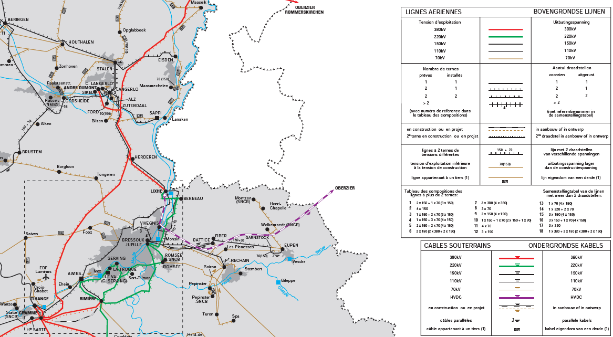

class: middle, center, title-slide
count: false

# Analysis of electric power and energy systems

Lecture 5: HVDC, power flow analysis part 3

  

Bertrand Cornélusse 
[bertrand.cornelusse@uliege.be](mailto:bertrand.cornelusse@uliege.be)

---

# What will we learn today?

- The power transformer
- The next part of power flow analysis: how to include transformers, and transformers with tap changers

You will be able to do exercises ... from the Ned Mohan's book.

---

class: middle

# The transformer

---

class: middle, center, black-slide

<iframe width="600" height="450" src="https://www.youtube.com/embed/vh_aCAHThTQ" frameborder="0" allowfullscreen></iframe>

---

class: middle, center

## A part of ELIA's network

.center[.width-100[]]

---

## The generic transmission line

Adapt from VCT's slides on power flow

---

class: middle

# Transformers in the power flow analysis

---

---

# References

- Mohan, Ned. Electric power systems: a first course. John Wiley & Sons, 2012.
- Course notes of ELEC0014 by Pr. Thierry Van Cutsem.
- L. Thurner, A. Scheidler, F. Schäfer et al, pandapower - an Open Source Python Tool for Convenient Modeling, Analysis and Optimization of Electric Power Systems, in IEEE Transactions on Power Systems, vol. 33, no. 6, pp. 6510-6521, Nov. 2018.

---

class: end-slide, center
count: false

The end.
