class: middle, center, title-slide
count: false

# Analysis of electric power and energy systems

Lecture 6: High Voltage DC transmission

  

Bertrand Cornélusse 
[bertrand.cornelusse@uliege.be](mailto:bertrand.cornelusse@uliege.be)

---

# What will we learn today?

- Why HVDC systems are used and how they are implemented (focus on LCC)
- How to insert a point-to-point HVDC line in a power flow analysis

You will be able to do exercises *TODO*.

---

class: middle, center

# Overview of HVDC applications

Introduction of former course "ELEC0445 - High Voltage Direct Current grids".

---

## Principle of HVDC links

-   HVDC links embedded in AC systems

-   Rely on converters :

    -   rectifier: from AC to DC

    -   inverter: from DC to AC

.center.width-80[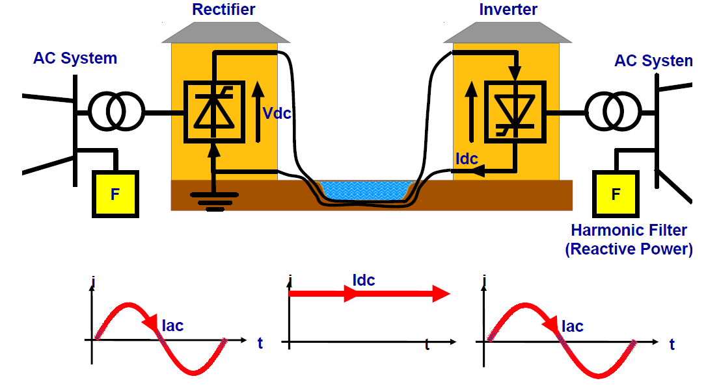]

---

## Historical perspective

-   At the beginning (end of 19th century) : two struggling parties

    -   first generators producing Direct Current (DC) - Gramme, Edison

    -   first generators producing Alternating Current (AC) - Ferranti,
        Tesla

-   Have a look at the video ["War of the currents"](https://www.youtube.com/watch?v=dIfIRj0Crc8)

-   the AC system won :

    -   possibility to increase and lower the voltage thanks to the
        transformer $\Rightarrow$ transmission of higher powers possible

    -   creation of a rotating field easy with three-phase AC windings

    -   impossibility to raise the DC voltage $\Rightarrow$
        impossibility to transmit large powers with DC

    -   limitation of the power of early converters : a few kW only

    -   difficulty of interrupting a DC current.

-   Revival of DC technology in the ‘50s

---

## Historical perspective (cont’d)

-   Advances in power electronics : converters can carry larger currents
    through higher voltages $\Rightarrow$ higher power ratings
    $\Rightarrow$ transmission applications possible

-   1882 : Marcel Deprez (France) and Oskar Von Miller (Germany, AEG)
    design the first transmission link between a DC source and a DC
    load:
    $15 \,\text{kW} ~~ 2\, \text{kV} ~~ 56.3\, \text{km}$

-   mid ‘30s : mercury-arc valve rectifiers made available.
    They open the way to HVDC transmission link projects

-   1945 : first commercial project of HVDC transmission in Germany.
    Not commissioned and moved to USSR (Moscow-Kashira) in 1950:
    $60\,\text{MW} ~~ 200\, \text{kV} ~~ 115 \, \text{km}$, with buried
    cables

-   1954 : first commercial HVDC submarine installation : from Gotland
    island to Sweden:
    $20 \,\text{MW} ~~ 100\, \text{kV} ~~ 98 \, \text{km}$

-   Up to the mid ‘60s, due to its higher cost, HVDC was favoured only
    where AC met operational difficulties, e.g. sea crossing

---

## Historical perspective (cont’d)

-   late ‘60s : advent of high power *thyristor*-based valve converters

-   1975 : 1st long-distance HVDC transmission using thyristor valve
    converters : Cahora Bassa in Mozambique: 
    $1920\,  \text{MW} ~~ 533\, \text{kV} ~~ 1420 \, \text{km}$, with
    overhead line
.center.width-20[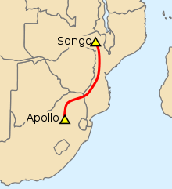]

-   thyristor ratings have grown up to $V=9$ kV and $I=4$ kA (per thyristor)

-   late ‘90s : high power *transistor*-based components become
    available : IGBT, MOSFET

-   development of *Voltage Source Converters*.
    Among other advantages, they allow controlling both the active and
    the reactive powers at the AC terminals of an HVDC link.

---

## First application : Power transmission over long distances

Long AC lines require reactive power compensation / voltage support and
for distances larger than 600-800 km, HVDC is more economical

Examples :

.grid[
.kol-1-2[
Pacific DC inter-tie along West coast of USA :
1360 km    3100 MW    $\pm$ 500 kV

Cahora-Bassa line in Mozambique :
1420 km    1920 MW    $\pm$ 533 kV

Hydro-Québec DC line :
1018 km    2000 MW    $\pm$ 450 kV
]
.kol-1-2[
.center.width-100[]
]]

---

## Smaller investment costs

.grid[
.kol-1-2[
.center.width-100[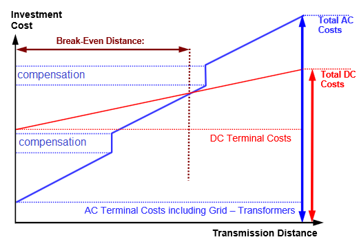]
]
.kol-1-2[
.center.width-100[]
]]

.grid[
.kol-1-2[
-   initial investment is higher for DC (due to converters) but

-   with increasing distance, reactive power compensation is required
    for an AC line

-   break-even distance 600-800 km
]
.kol-1-2[
-   comparison of towers : same transmission capacity of 3 GW, a) 735 kV
    AC   b) $\pm$ 500 kV DC

-   smaller Right-of-Way for DC corridor

-   reduced footprint
]]

---

## Lower losses, higher thermal capacity

.center.width-50[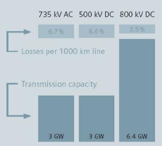]

At a similar voltage level (RMS phase-to-phase vs. DC pole-to-ground) :

-   a DC line can transmit more than twice the power of an AC line

-   with about half the losses of an AC line.

---

## Second application : submarine power transmission

.grid[
.kol-1-2[
-   AC cables have large capacitance. Maximal acceptable length : 50-70
    km.
    - For larger distances, HVDC is the only (reasonable) solution

-   Examples from Europe :

    -   *NorNed* link between Norway and The Netherlands (2008)\
        580 km   700 MW   $\pm$ 450 kV (LCC type)

    -   *Nemo* link between Belgium and UK (2019)\
        140 km   1000 MW   $\pm$ 400 kV (VSC type)

    -   Connections of off-shore wind parks in North Sea to the
        continental European grid
]
.kol-1-2[.center.width-80[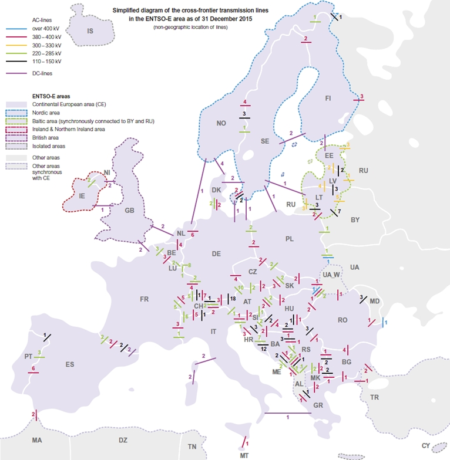]
.center[*Source ENTSOe (www.entsoe.eu)*]
]]

---

## Third application : DC link in AC grid, for power flow control

-   power flows in AC lines cannot be controlled directly

    -   determined by line impedances, obeying Ohm and Kirchhoff laws

    -   partially controllable by phase shifting transformers

-   power flows in HVDC links can be controlled directly (through the
    controllers of converters). This can be used :

    -   to limit “loop flows” and overloading of AC lines

    -   to make the link participate in energy tradings.

-   Examples :

    -   *ALEGrO* (Aachen Liège Electric Grid Overlay) project of
        HVDC link between Belgium and Germany (2020):
        100 km (49 in Belgium)   1000 MW   buried cable

    -   France - Spain DC interconnection :
        65 km   buried XLPE cable   $\pm$ 320 kV DC   2000 MW
---

## France - Spain DC interconnection

.grid[
.kol-1-2[
- Can reverse power flow in 150 milliseconds (!)
- Investment cost : 700 M€
]
.kol-1-2[
.center.width-80[]
]]
.grid[
.kol-1-2[
.center.width-80[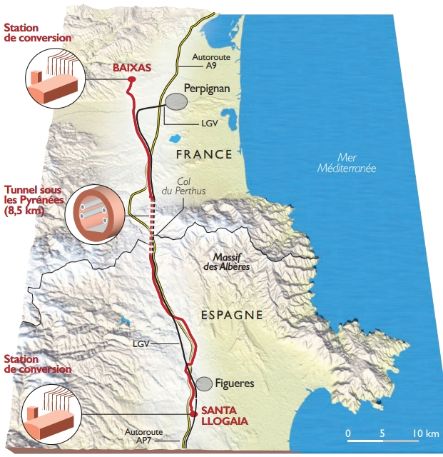]
]
.kol-1-2[
.center.width-60[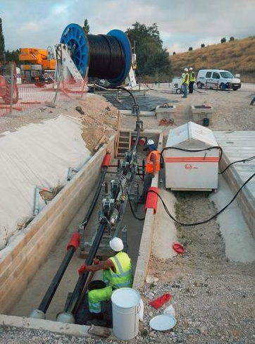]
]]

---

## Fourth application : interconnection of asynchronous AC systems

*Two AC networks with different nominal frequencies.*

    *Back-to-back connection (rectifier and inverter in same substation)*

.grid[
.kol-1-2[
-   Melo HVDC link between Uruguay (50 Hz) and Brazil (60 Hz)  
    500 MW  $\pm$ 79kV
-   Shin Shinano HVDC link between Western (60 Hz) and Eastern (50 Hz) power grids of Japan  
    600 MW  $\pm$ 125 kV
]
.kol-1-2[
.center.width-80[]
]]

---

*Two AC networks with identical nominal frequency but different
    frequencies (not interconnected for size reasons)*

.grid[
.kol-1-2[
Highgate back-to-back HVDC link between Québec and Vermont 
    200 MW   $\pm$ 57 kV
.center.width-80[]
.center.width-80[]
]
.kol-1-2[
McNeil HVDC link between Alberta and Saskatchewan  
    150 MW   $\pm$ 42 kV
.center.width-80[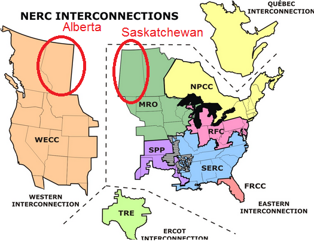]]]

---

## Fifth application : Multiterminal DC grids

*Radial* DC link with AC/DC converter(s) connected at intermediate points
.grid[
.kol-1-2[
.center.width-60[]
]
.kol-1-2[
A few systems are in operation today with proven technology
-   example : the Sardinia-Corsica-Italy link (SACOI)
3 terminals. The 2-terminal Italy-Sardinia link was initially built, and the Corsica terminal installed at a later stage
-   more elaborate control scheme than for a two-terminal link
]]
.grid[
.kol-1-2[
Another application : collect power from off-shore wind parks
        located along a DC link between two on-shore terminals
]
.kol-1-2[
.center.width-60[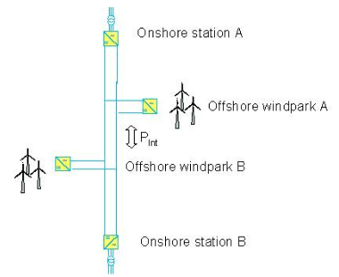]
]]

---

## Meshed DC grids

-   still at research level

-   typical targeted application : (i) collect power from off-shore
    wind parks, and (ii) allow power exchanges between on-shore
    grids

.center.width-50[]

-   main technological challenges :

    -   identification of faults in DC grid (to isolate only the
        faulted branch)

    -   DC circuit breaker to interrupt the DC fault current

---

## Two technologies

.grid[
.kol-1-2[
**Line Commuted Converters (LCC)**
-   large power ratings
-   large harmonics filters
-   requires a strong enough AC grid
-   active power is controlled
-   always consumes reactive power
-   cannot be used as off-shore terminal to collect wind power
-   cheaper (but VSC is a fast evolving technology)
-   less commutation losses than VSC
-   but possible commutation failure
]
.kol-1-2[
**Voltage Source Converters (VSC)**
-   lower power ratings (but fast growing technology)
-   less harmonic filters needed
-   can operate with a weak AC grid
-   active powers can be controlled
-   can be used as off-shore terminal to collect wind power
-   black start capability
]]

---

## LCC technology

.center.width-50[]

-   based on thyristors, used as switches closed with delay
-   thyristor commutation synchronized with grid voltage
    (hence the term “line commutated”)
-   also referred to as “Current Source Converter” or “classic HVDC”
-   DC current cannot be reversed (due to thyristors).
    Hence, power is reversed by reversing the DC voltage polarity.

---

## VSC technology

Based on Insulated Gate Bipolar Transitors (IGBT), used as *self-commutating* switches

Two topologies :
.grid[
.kol-1-2[
.center.width-100[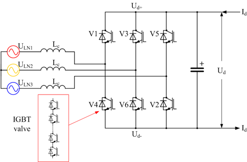]
    Pulse Width Modulation (PWM)
]
.kol-1-2[
.center.width-80[]
    Modular Multilevel Converter (MMC)
]]
Power is reversed by reversing the current.

---

class: middle, center

# Components of an LCC HVDC link

---

## A typical LCC HVDC system

.center.width-100[]

---

## Converters

.center.width-100[]

-   one converter at each terminal : the sending power end acts as a
    rectifier, the receiving power end as an inverter
-   each converter includes one or several thyristor bridges
-   each bridge is made up of 6 thyristor valves
-   each thyristor valve contains hundreds of individual thyristors

---

## Converter transformers

.center.width-100[]

-   designed to operate with high harmonic currents
-   generally more expensive than typical transmission transformers of
    the same rating
-   most generally equipped with load tap changers. The transformer
    ratios are adjusted to optimize the HVDC link operation

---

## Smoothing reactors on the DC side

.center.width-100[]

-   aimed at limiting the DC current variations
-   designed considering response to DC faults and commutation failures
-   typical values of inductance : 0.1 to 0.5 H
-   air-core, natural air cooling type

---

## Harmonic filters

.center.width-100[]

-   aimed at filtering the harmonics generated by the AC/DC conversion
-   most important harmonics to eliminate : 11th, 13th, 23rd and 25th
    (for converters with two bridges)
-   some HVDC systems are also equipped with filters on the DC side

---

## Reactive power compensation

.center.width-100[]

-   the converters consume reactive power (around 60% of power rating)
-   that reactive power varies with the active power level
-   a large part of the reactive compensation comes from the filter banks
-   the remaining part is supplied by switchable capacitor banks

---

## Control and communication systems

.center.width-100[]

-   each terminal has a control system with multiple hierarchical layers
    : control of resp. the DC current, the DC voltage, the thyristors, etc.
-   a dedicated communication link is needed between both terminals to
    optimize system operation

---

class: middle, center

# Thyristor valves

---

## The thyristor

-   Essential component of HVDC valves in the LCC technology
-   operates as a controllable diode
-   can have high power ratings : up to 8.5 kV, 4500 A capability
-   is robust and efficient.

Four-layer, three-terminal device.
.grid[
.kol-1-2[
Three $pn$ junctions $J_1$, $ J_2$, $J_3$
.center.width-100[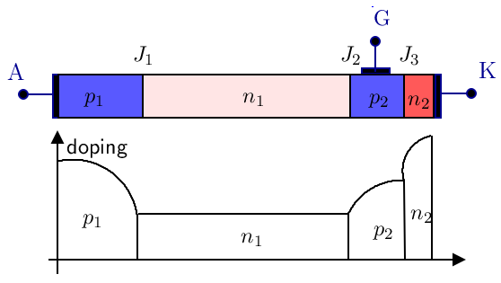]
]
.kol-1-2[
-   equivalent to two bipolar transistors
-   assume $V_{AK}>0$ and inject $I_G$
-   both transistors remain in saturation even if $I_G$ is suppressed
.center.width-70[]
]]

---

## Modes of operation of the thyristor 

Three modes of operation depending on :
-   the sign of the anode $-$ cathode voltage $v_{AK}$
-   whether a current $I_G$ is injected at the gate terminal

A *reverse voltage $v_{AK}<0$* is applied.
-   Junction $J_2$ is in *forward* bias mode
-   junctions $J_1$ and $J_3$ are in *reverse* bias mode
-   the thyristor acts as a diode in reverse bias mode; it is in *off-state*
-   breakdown occurs when $v\_{AK}$ is more negative than the *reverse breakdown voltage*
    $V\_{BR}$. Most often this is associated with junction $J_1$
-   in HVDC applications, the breakdown mode must be avoided since
    it can lead to material destruction.
-   hence, thyristors with high $|V_{BR}|$ values must be used, and
    measures taken to limit the avalanche current.

---

## Modes of operation of the thyristor (...)

A *forward voltage $v_{AK}>0$* is applied 
-   Junctions $J_1$ and $J_3$ are *forward* in bias mode
-   junction $J_2$ is in *reverse* bias mode
-   the thyristor behaves as a diode in reverse bias mode; it is in *off-state*
-   breakdown occurs when $v_{AK}$ is larger than the forward breakdown voltage of junction $J_2$

.center.width-70[]

---

## Modes of operation of the thyristor (...)

A *forward voltage $v_{AK}>0$* is applied and *a current $I\_g$ is injected*.
-   the current injection results in an avalanche process
-   “as if” layer $p_2$ would become of $n$-type. Hence, the
    thyristor behaves as a $pn$ diode in forward bias mode : it
    switches to *on-state*
-   the thyristor resistance is dramatically reduced (from
    $10^6 \, \Omega$ to $10^{-1}\, \Omega$)
-   the larger $I\_G$, the smaller the value of $v\_{AK}$ needed to
    initiate the avalanche.

---

## Operation of the thyristor in on-state

.center.width-100[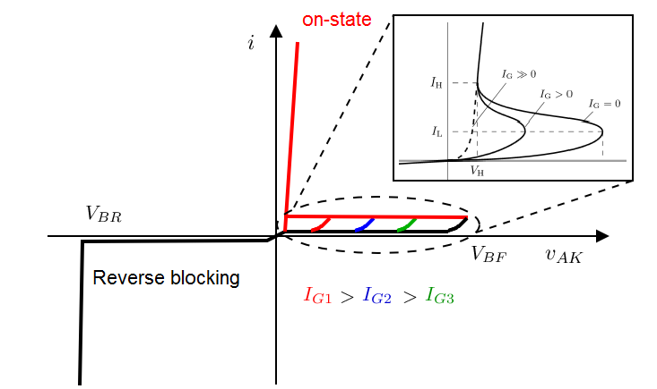]
-   once the anode current $i$ reaches $I_L$, the , the thyristor
    switches to on-state
-   once the thyristor is in on-state, the gate current can be removed
-   the gate current is usually a short pulse lasting 10-50 $\mu$s
-   if $i$ falls below $I_H$, the , the thyristor switches to off-state.

---

## The ideal characteristic

.center.width-100[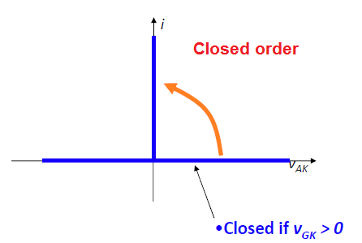]
.center.width-100[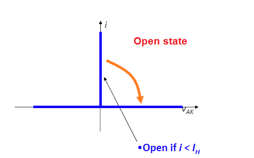]

-   closed order given by gate current
-   in open state, $V_{BR}$ and $V_{BF}$ are assumed infinite
-   when the thyristor conducts, a zero internal resistance is assumed
-   when the thyristor conducts, a zero terminal voltage is assumed.

---

## Switching characteristics

**From off-state to on-state**:

-   initially, the thyristor is forward biased ($v_{AK}>0$)
-   one pulse of $I_G$ initiates conduction
-   switching takes place during the (a few $\mu$s):
    -   the current increases
    -   the voltage decreases to about 0.5 - 2.5 V

.center.width-100[]

---

**From on-state to off-state**:

-   the thyristor turns off when $i$ falls below $I_H$ and reverses
-   recombinations of charge carriers take place in junctions $J_1$ and
    $J_3$, which switch to reverse bias mode
-   a maximum reverse current is observed and the voltage is reversed
-   an over-voltage can be observed if current extinction is too fast
-   once the charge carrier recombination is completed, $i$ goes to
    zero.

.center.width-100[]

---

Summary of chap2.pdf

---

class: middle, center

# Operation of the LCC line

---

Almost all of chap3.pdf

---

class: middle, center, black-slide

<iframe width="600" height="450" src="https://www.youtube.com/embed/WVI8Z7p_rdY" frameborder="0" allowfullscreen></iframe>

6-pulse rectifier

---

class: middle, center

# Control

---

A summary of chap4.pdf, aligned with Ned Mohan's book.

---

class: middle, center

# Interaction between AC and DC

---

Elements of Chap6.pdf as a transition with pf analysis

---

class: middle

# HVDC in the power flow analysis

---

Discuss the simple implementation in panda power.

Discuss the implementation of Bondhala - 2011 - Power Flow Studies of an AC-DC Transmission System

Braunagel, Kraft, Whysong - 1976 - Inclusion of DC converter and transmission equations directly in a newton power flow.

---

# References

- Mohan, Ned. Electric power systems: a first course. John Wiley & Sons, 2012.
- [Course notes of ELEC0445](https://people.montefiore.uliege.be/vct/courses.html) by Pr. Thierry Van Cutsem and al.
- L. Thurner, A. Scheidler, F. Schäfer et al, pandapower - an Open Source Python Tool for Convenient Modeling, Analysis and Optimization of Electric Power Systems, in IEEE Transactions on Power Systems, vol. 33, no. 6, pp. 6510-6521, Nov. 2018.

---

class: end-slide, center
count: false

The end.
