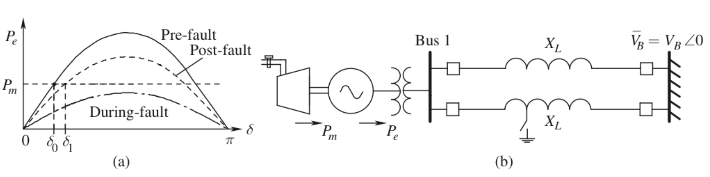
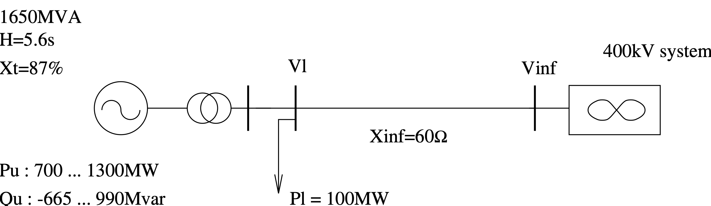
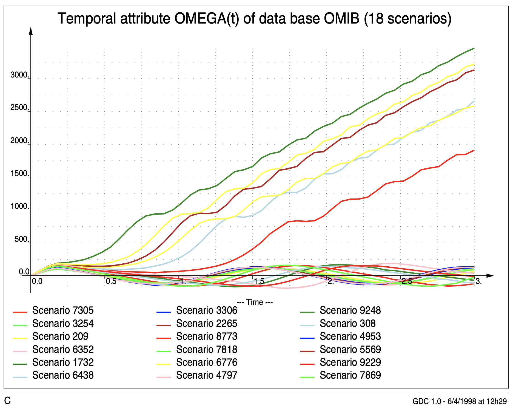
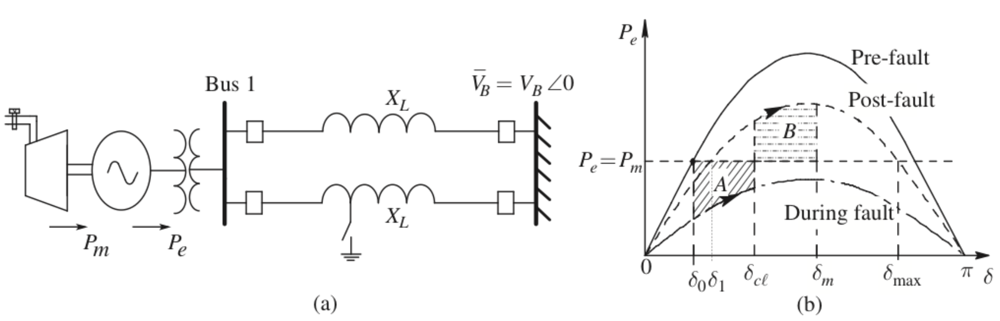
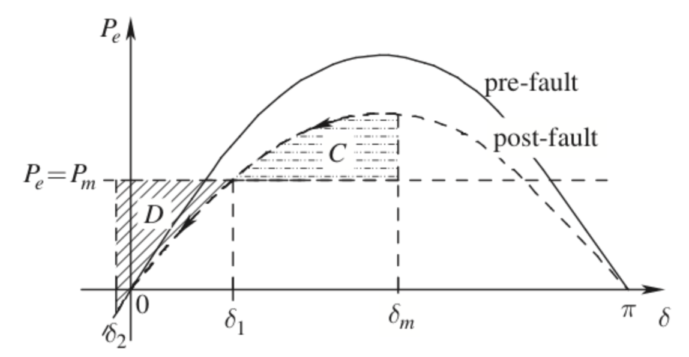
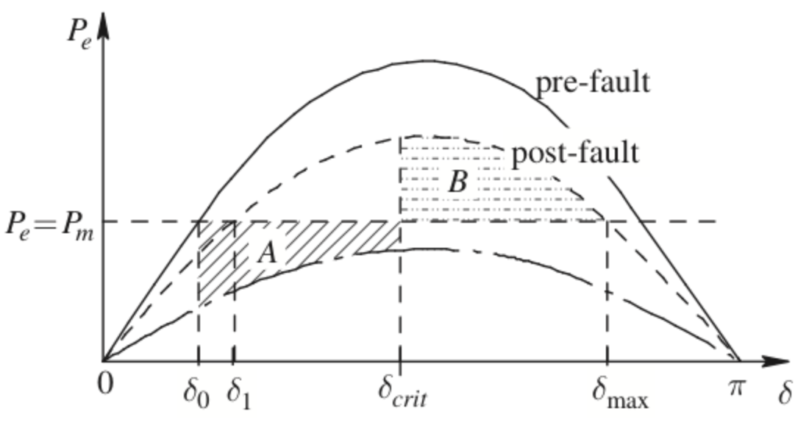
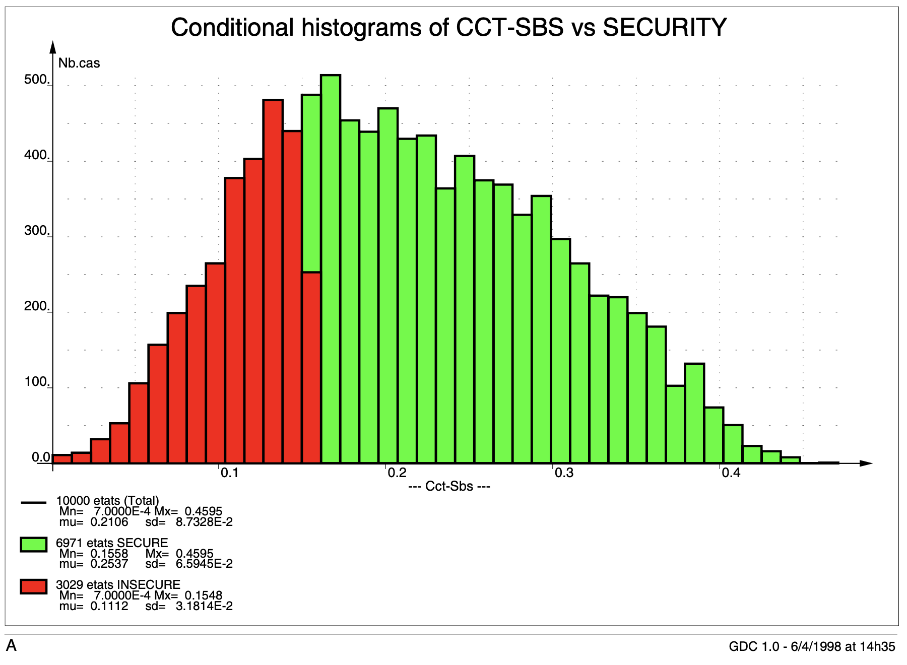
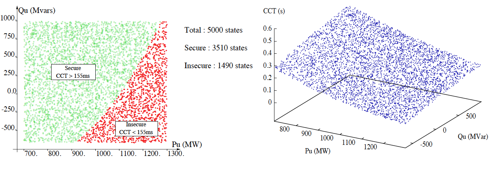

class: middle, center, title-slide
count: false

# Analysis of electric power and energy systems

<!--
 
python3 -m http.server 8001 &

decktape http://0.0.0.0:8001/?p=lecture8.md pdf/lecture8.pdf

http://0.0.0.0:8001/?p=lecture8.md#1
-->

Lecture 8: Transient and dynamic stability

  

Louis Wehenkel 
[L.Wehenkel@uliege.be](mailto:L.Wehenkel@uliege.be)

---

# What will we learn today?

- Swing dynamics, loss of synchronism, and transient (in)stability
- Dynamic stability and interarea oscillations
- Cascading phenomena

***

*This lecture expands on Chapter 11 from Ned Mohan's book.*

---
class: middle

# First-swing transient (in)stability problem

---

class: middle

# One-Machine-Infinite-Bus system (OMIB)

.center[.width-95[]]

See Figure (a):

- On the left, a synchronous generator driven by a turbine
  providing mechanical power $P_m$, and connected via a up-step transformer to the
  grid to deliver its electrical power $P_e$ (it is called *the
  machine*). 

- On the right of Fig (a), a very large system operating at synchronous
frequency (it is called *the infinite bus*) and imposing the
voltage $V_B \angle 0$.

- A double-circuit line (twice $X_L$ in parallel) connecting the two parts. 

---

## Electric model of the OMIB system 

.center[.width-95[]]

See Figure (b):

- The machine is electrically represented as an ideal voltage source ($E'
\angle \delta$) behind a transient reactance  $X'_d$.

- Active power losses in the step-up transformer are neglected, and
the transformer is simply modeled as a series reactance $X_t$.

- The two parallel circuits of the line are assumed of equal reactance $X_L$ and
  their resistances and capacitances are neglected.

- The losses of the electro-mechanical conversion $P_m \rightarrow P_e$ are neglected.

---

## The typical scenario of transient stability studies

.center[.width-95[]]

- Initially the machine is operating in steady state corresponding to
  an angle $\delta_0$ defined by the "Pre-fault" electric power characteristic.

- At $t_0$, a short-circuit appears on one of the two
circuits of the line, resulting in a sudden decrease of the electric.
power $P_e$ delivered by the machine, according to the "During-fault"
curve. *The machine accelerates, because now $P_e < P_m$, hence its rotating
  speed $\omega_m$ and its angle
  $\delta$ start to increase.*

- At $t_1 > t_0$, the short-circuit is cleared by breakers opening the circuit
at its two ends, resulting in an increase of the electric power $P_e$,
according to the "Post-fault" curve. *This typically leads to a
deceleration, but the speed $\omega_m$ is above the synhronous speed, the
angle continues to increase.*

---

## Remarks and simplifying assumptions

- The (active) electrical power delivered by the machine is given by
$$P_e = \frac{ E' V_B }{ X_T } \sin \delta$$
where $X_T$ and $V_B$  denote the reactance and voltage seen by
$E' \angle \delta$.

- The machine is rotating at the mechanical speed
$\omega_m$ (rad/s), and in the initial steady state this corresponds to the
synchronous speed. 

- A power flow solution assuming a $PV$ or a $PQ$ node at the generator $HV$
  bus, provides $\bar{V}_1$ from which we can compute
  $E'$ and $\delta$ in steady state.

- $P_m$ in steady state is set to the active power initially produced by the machine.

- Typically, a line-fault in EHV systems is cleared in less than
  100ms, a study period of 1-2 seconds is often sufficient to check
  stability/instability.

-  We assume here that $P_m$ and $E'$ can be considered as constant during
the study period, but governor and excitation systems tend to improve stability.

---

## Derivation of the swing equations

- Accelerating and decelerating torques acting on the mechanical speed
$$J_m \frac{d^2 \delta_m}{dt^2} = T_m - T_e$$
where $J_m$ is the moment of inertia.

- In terms of powers we have

$$\omega_m J_m \frac{d^2 \delta_m}{dt^2} = P_m - P_e$$

- Converting to electrical angles $\delta$ and electrical speeds $\omega$, and
observing that in practice $\omega \approx
\omega_s$, we obtain 
$$M \frac{d^2 \delta}{dt^2} = P_m - P_e$$
(where $M = 2H / \omega_s$, see reference book for derivations).

- NB: typically $H \in [1 - 10]$seconds in machine MVA-base.

---

## Typical swing-curves computed by time-domain simulation

.center[.width-70[]]

.center[.width-70[]]

---

## The equal area criterion (forward swing)

.center[.width-85[]]

- Kinetic energy gained in the 'During-fault' acceleration period
$$A = \int_{\delta_0}^{\delta_c} (P_m - P_e) d \delta$$
- The kinetic energy lost in the 'Post-fault' deceleration period
$$B = \int_{\delta_c}^{\delta_m} (P_e - P_m) d \delta$$ 
- Condition $A=B$, correponds to $\omega_m = \omega_s$ while
$P_e (\delta_m)  > P_m$: a maximum angle is reached,
and subsequently the system swings-back.

---
## The equal area criterion (back swing)

.center[.width-50[]]

- Kinetic energy lost in the back-swing deceleration period
$$C = \int_{\delta_m}^{\delta_1} (P_m - P_e) d \delta$$
- The kinetic energy gained in the back-swing acceleration period
$$D = \int_{\delta_1}^{\delta_2} (P_e - P_m) d \delta$$ 
- There always exists a
$\delta_2$ such that $C=D$. After that, the angle increases again until $\delta_m$, and
  decreases again until $\delta_2$ etc. (There is no damping...)

---
## The notion of critical clearing time

.center[.width-50[]]

- Increasing the time $t_{c}$ to clear the fault increases the clearing angle $\delta_c$ and hence area $A$.
Therefore $\delta_m$  will also increase to have area $B$
increase as well so as to  compensate the new value of $A$.
- Once $\delta_{\max}$ is reached, it is not possible to compensate
for a further increase in $\delta_c$. This corresponds to the critical
fault-clearing angle.
- The time needed in the during-fault
configuration to reach this critical clearing angle is called the
*Critical Clearing Time (CCT)*.
- One shows that with our simple model, if $t_1 - t_0 < CCT$ the
system is stable, and otherwise unstable.
- In practice there are several sources of damping helping
  further out.

---

## Illustration of CCT values (example of slide 7)

.center[.width-50[]]

.center[.width-100[]]

---
## Discussion

- Multi-machine systems and load models
  - Machines that are located closer to the fault will
  accelerate more during the fault
  - Static loads as impedances, dynamic loads as induction motors,
    HVDC special models
- Effect of voltage and mechanical power controls and damping
  - Typically favorable, because they want voltage and speed to be
  close to nominal 
- Effect of fault-type, location, and clearing scheme
  - The faster fault clearing, the better; fast line reclosing can be useful 
  - Three-phase short-circuits worse than single phase, the closer to the generator the worse
- Effect of increasing the distance towards the rest of the system
generators
  - The longer the distance of a power plant from the rest of the system,
  the more problematic from the viewpoint of transient instability.
  - Series compensation and/or shunt SVCs may help a lot
- Emergency control and other stability enhancements
  - Generator tripping
  - Fast mechanical power reduction, or electric braking

  ***

*Transient instability is typcially much faster than voltage instabiliy*

---

class: middle

# Inter-area instabilities and undamped oscillations

#####    

##### Read section 11.4 from reference book

##### Figures on the next slide are taken from: CIGRE 2000, Paper No 38-113, Analysis and Damping of Inter-Area Oscillations in the  UCTE/CENTREL Power System, H. Breulmann, et al

---

.center[.width-90[]]

---
class: middle

# Illustration of cascading phenomena

---

.center[.width-100[<video controls="controls">
  <source type="video/mp4" src="figureslw/Cascade.mp4"></source>
</video>]]

Simulation of cascading phenomena on the French south-eastern region

---
class: middle

# Likely impact of the energy transition

---

## A think tank

- Less synchronous generators in operation at the transmission level
- Duck curve
- Higher variability of flows and flow-directions at the transmission level
- Tech opportunities 

---

# References

- Mohan, Ned. Electric power systems: a first course. John Wiley & Sons, 2012.

---

class: end-slide, center
count: false

The end.

