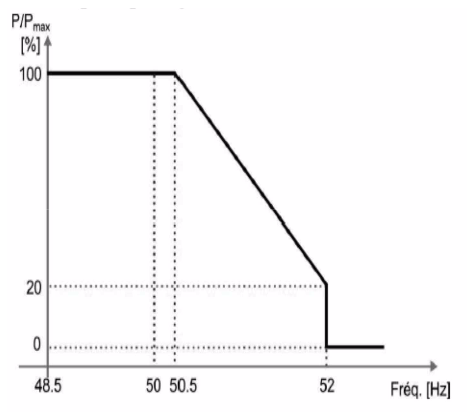
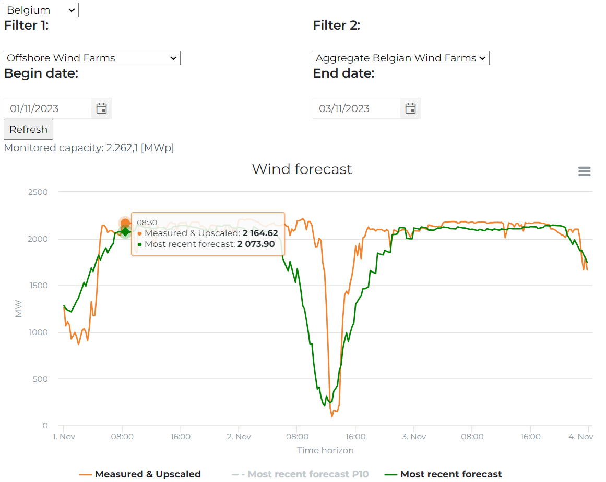
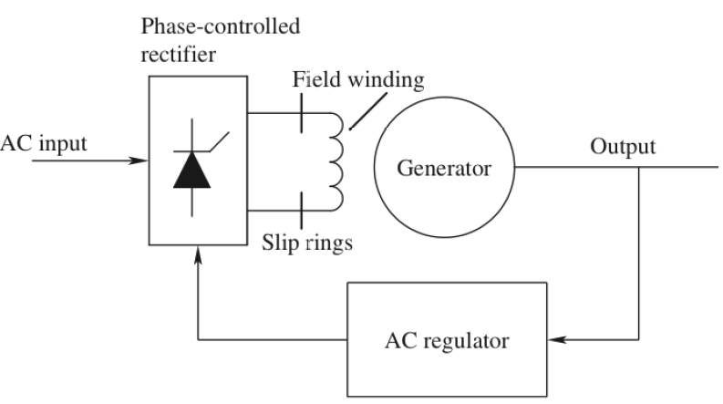

class: middle, center, title-slide
count: false

# Analysis of electric power and energy systems

<!--
 
python3 -m http.server 8001 &

decktape http://0.0.0.0:8001/?p=lecture8.md pdf/lecture8.pdf

http://0.0.0.0:8001/?p=lecture7.md#1
-->

Lecture 9: Frequency control

  

Bertrand Cornélusse and Louis Wehenkel  
[bertrand.cornelusse@uliege.be](mailto:bertrand.cornelusse@uliege.be)

---

# What will we learn today?

- Why do we need to control the voltage and frequency ?
- Control approaches of voltage and frequency in power systems
- Economic dispatch and optimal power flow methods (brief introduction)
- Power systems security assessment introduction (N-1 criterion)

This lecture expands on Chapter 12 from the Ned Mohan's book.

---

class: middle

# Why and how to control voltage and frequency ?

- Technical requirements
 - Power system devices are designed so as to operate within well-defined
   'tolerance regions' around nominal values $V_n$ and $f_n$
 - Large/persistent deviations from
 nominal values could lead to cascading phenomena, service interruptions, and safety problems

- Exogenous threats
 - Sudden disturbances, such as line or generator tripping
 - Fast variations of net load (cf Duck curve)
 
- Control resources
 - Adjusting synchronous generators' field current and mechanical
 power 
 - Changing transformer taps,
 or switching lines and/or shunt compensation 
 - Fast start-up of generator units and/or in extremis load curtailment

---

# System frequency evolution: theory, example, and intuition

Let us consider a power system with loads and, for now, only synchronous generators.

Let 

- $p_e(t)$ be the total power absorbed by the loads (incl. losses in the network)
  - this is thus equal to the electrical power that generators must output (Kirchhoff laws)
- $p_m(t)$ be the mechanical power input to generators

Except for the losses mentioned above, we neglect the network.

**How does the frequency of the system $f(t)$ (and thus of the machines) evolve?**

---
# The swing equation 

From Newton's law ($J\alpha = T\_m-T\_e$) we can derive similarly

$$J \frac{df}{dt} = \frac{p\_m - p\_e}{4\pi^2 f} - D\_g (f-F\_{\text{nom}})$$

Where 

- $J$ is the total inertia of the generators,
  - the formula for a generator $i$ as a function of its characteristics ($H$, $P\_{\max,i}$):
  $$J\_i = \frac{2 P\_{\max,i} H\_i}{4 \pi^2 F\_{\text{nom}}^2}$$
- $D_g$ is a damping coefficient ([remember the damping windings](https://bcornelusse.github.io/ELEC0447-analysis-power-systems/?p=lecture5.md#18))
- $F_{\text{nom}}$ is the nominal frequency of the network ($50 Hz$)

**What happens in case there is a power imbalance (if there is little damping)?**

**What if the inertia of the system decreases?**

---

# To answer thes questions, let's look at some simulations

[Link to the simulations](https://colab.research.google.com/drive/1vARBr5wfm9uHCokRx3kcoK_RWjrOvnA5?usp=sharing)

The code is organized in 3 main parts:

 1. Plotting functions 
 2. A class encoding the power system data and the set of differential equations governing the system
 3. Simulations for several cases

---

# Let's add generator reaction to frequency change

$$T\_{sm} \frac{d p\_m}{dt} = P^0\_m - p\_m - \frac{P\_{\max}}{\sigma}\frac{f-F\_{\text{nom}}}{F\_{\text{nom}}}$$

Where 
 - $T_{sm}$ is the primary control time constant, assumed equal to $1.5 s$,
 - $P^0_m$ is the set point for the generation
 - $\sigma$ is the coefficient of droop of the primary control, which is $4\%$,

**What is the impact of the droop?**

---

# We should not forget generator limits

$$p\_m \in [P\_{\min}, P\_{\max}]$$

Where 

 - $P_{\max}$ the maximum power available for primary control
 - $P_{\min}$ the minimum power available for primary control

**What is the consequence of these limits?**

---

# But the power consumed by the load is frequency dependent

$$p\_e = P\_e^0 (1+D\_l (f-F_{\text{nom}}) )$$

where:

 - $P^0_{e}$ nominal (or initial) consumption 
 - $D_l$ the sensitivity of consumption to frequency, assumed equal to $1\%$.

Not all loads are frequency dependent.

**Do you see the impact on the curves? **

---

# Let's now add renewable generation

Assume we now have $p_{PV}(t)$ generated by a PV farm.

**Which equation does it impact?**

Our model so far:
$$J \frac{df}{dt} = \frac{p\_m - p\_e}{4\pi^2 f} - D\_g (f-F\_{\text{nom}})$$
$$T\_{sm} \frac{d p\_m}{dt} = P^0\_m - p\_m - \frac{P\_{\max}}{\sigma}\frac{f-F\_{\text{nom}}}{F\_{\text{nom}}}$$
$$p\_m \in [P\_{\min}, P\_{\max}]$$
$$p\_e = P\_e^0 (1+D\_l (f-F_{\text{nom}}) )$$

---

# Let's now add renewable generation

Assume we now have $p_{PV}(t)$ generated by a PV farm.

**Which equation does it impact? **

$$J \frac{df}{dt} = \frac{p\_m - p\_e \color{red}{+ p\_{PV}}}{4\pi^2 f} - D\_g (f-F\_{\text{nom}})$$

**What is the consequence?**

---

# Let's add over frequency curtailment of renewable generation

.center[.width-50[]]

---

# Let's add over frequency curtailment of renewable generation: model

if $f < 50.5 Hz$:

$$p\_{PV} = P^0_{PV} $$

else if $ 50.5 \leq f < 52 Hz$:

$$p\_{PV} = P^0_{PV} (1 - \frac{0.8}{1.5}(f-50.5)) $$

else if $f \geq 52 Hz$:

$$p\_{PV} = 0.0$$

where $P^0_{PV}$ is the maximum solar output at the initial instant of simulation.

Note: With more RES, les synchronous machine, so relatively less inertia for same demand.

---

# Impact of the storm on wind generation

.center[.width-70[]]

From https://www.elia.be/en/grid-data/power-generation/wind-power-generation

---

class: middle

# Principle of Automatic Frequency Control

- *The main tool:* primary frequency control via *speed governors* of large synchronous generators
- Secondary frequency control (aka *Automatic Generation Control  (AGC)*)
- Tertiary frequency control 

---

## Speed governor  of  a synchronous generator

.width-55[] .width-30[] 

- Measurement of rotor speed (or stator frequency as a proxy)
- If frequency (speed) is a bit below $f_0$, the governor opens a bit
more the valve to increase the mechanical power $P_m$
- In steady state, speed and mechanical power (or equivalently, frequency and electric
  power) are related by a linear relationship (see diagram on the right)
- This relationship allows predicting how the power generated by a
certain generator would change when frequency changes
- It also shows that in order to have the generator adapt his power
  via this primary control loop,
  the frequency must change

---

## The case of two generators helping out with a sudden increase of load

.width-90[]

- Imagine that suddenly load power increases by $\Delta P_L$: because of KL, total electric power of generators will also
increase, hence they start to decelerate leading to a frequency drop. Both will react, according to the governor settings of their primary
frequency control loop, to increase their mechanical power
- At steady state, $\Delta f$ will be such that
$\Delta P_1+ \Delta P_2 = \Delta P_L$; typical time to reach steady state: 10-20s
- Depending on mechanical inertia and speed of governor controls, frequency 'nadir' can be much lower
  than final $f_0 + \Delta f$ at steady state.

---
## Primary frequency control in an interconnected system

- Goal: avoid too large frequency drop upon sudden loss of (the
largest) generator connected to the system
 - Each area contributes in proportion to its load level,
 - Within each area, some generators are recruited to ensure area
requirement,
 - There is a mutualization of primary frequency control reserves.
 - If primary frequency control is unable to prevent a too large drop in frequency,
    more heroic emergency controls will act, e.g.
    under-frequency load shedding (see Movies)

.center[.width-60[]]

##### Fig from: https://top10electrical.blogspot.com/2015/10/primary-secondary-and-tertiary.html

---

class: middle, center, black-slide

<iframe width="600" height="450" src="https://www.youtube.com/embed/Bfe0LaIUJ5g?list=PLXUccGn4ptEMJ6vVL6f5DOzQIEuAT941q" frameborder="0" allowfullscreen></iframe>

Automatic under frequency load shedding

---

## Secondary frequency control (aka AGC)

- After (gentle and successful) settlement of primary frequency
control there are however some
undesirable side effects:
 - Frequency has deviated from the nominal value
 - The exchanges between areas have deviated from their scheduled
 values
 - Part of the primary frequency control reserves have been depleted
- AGC (or secondary frequency control) aims at cancelling these side effects:

.width-70[]

 - Since AGC is an integral control, its steady state corresponds to
 zero $\Delta f$ and zero $\Delta P$ (tie-line flows are also steered
 back to scheduled values)
 - Once frequency is back to normal, primary control reserves are
   again fully available (takes 5-15 minutes)

---

## Primary, secondary and tertiary frequency control

- *First*, primary control stabilizes frequency and power balance
 - response within 0-30s, fully local and fully automatic
- *Second*, frequency and power exchanges are brought back to
nominal/contractual values, and primary control reserves are restored
 - response within 0.5-15 minutes, via area-control center (e.g. one
   country in Europe)
- *Third*, generation and exchange schedules are re-optimized, while
restoring secondary frequency control reserves
 - response within 10-60 minutes, e.g. via intraday power exchange
   markets 

.center[.width-95[]]

##### Fig from: https://top10electrical.blogspot.com/2015/10/primary-secondary-and-tertiary.html

---

class: middle

# Principle of Automatic Voltage Control

- *The main tool:* primary voltage control via *Automatic Voltage
  Regulators (AVRs)* of large synchronous generators and synchronous condensers
- Secondary voltage control and automatic switching of reactive
compensation devices and transformer taps
- Tertiary voltage control and voltage profile optimization

---

## Automatic voltage regulator of a synchronous machine (reminder)

.width-35[] .width-60[]

##### Figure on the right from: Voltage stability of electric power systems. T. Van  Cutsem & C. Vournas, KAP 1998

- Notice that if several generators are connected in parallel (either
  at the MV or at the EHV bus), it is necessary to coordinate
  their AVRs so that they share the reactive power in an even way.

- The value of $Z_c$ may be adjusted in order to ensure such a coordination.

---

## Primary, secondary and tertiary voltage control

- When a disturbance occurs, or subsequently to following the change
  in load (cf. 'duck curve'), the *primary* voltage control loops
  maintain suitable voltage levels close to the large power plants equipped with AVRs.

 - However, voltages at other buses may move out of tolerance intervals
  (in either direction), and reactive power reserves may
  not be shared in an even way among generators.

- *Secondary* voltage control loops can be used at the zonal
 level, to adjust the set-points of AVRs
so as to control the voltage at 'pilot nodes' in the network while distributing
the required reactive power evenly among generators.

 - Secondary voltage control loops can also be used to
switch shunt reactive compensation devices (capacitors/inductors) in
 order to increase reactive power generation margins in their zone
 (among a few large power plants).

- *Tertiary* voltage control uses OPF solvers to calculate set-points
  at pilot nodes and possibly adjust some transformer ratios, so as to minimize losses
  and maximize MVar reserves at the entire system level.

- Response times of different levels of voltage control

 - *Primary:* 1-3 seconds ; *Secondary:* 30 seconds -3 minutes ; *Tertiary:* 10-15 minutes 

---

class: middle

# Economic dispatch and optimal power flow 

---

## Economic dispatch problem statement (ED)

Solve an optimization problem 

- Given a total load $P_L$ to serve, and a set of candidate generators
  $i=1\ldots n$, with $P_i$ constrained to $\underline{P}_i \ldots \overline{P}_i$, and a cost function $C_i(P_i)$,
- Find optimal values $P_i$ such that $\sum_i^n C_i(P_i)$ is minimized
  - while ensuring $\sum_i^n P_i = P_L$ (+ a loss term, possibly).
- See 12.4.1 of ref. book for some intuition about the solution to this problem

---

## Optimal power flow problem statement (OPF)

- As above, + network constraints

- Given 
 - network topology, 
 - electrical parameters of lines, cables, transformers, and shunt devices, 
 - current flow limits of lines and transformers, and voltage tolerance intervals
at buses

- Determine the $P_i$ such that $\sum_i^n C_i(P_i)$ is minimized
 - while modeling Kirchhoff laws and enforcing the above network-wise limits

---

class: middle

# Assessing the security/reliability of an electric power system

- General idea of security assessment
- Standard *N-1*  static security assessment
- Voltage stability assessment (next lecture)
- Transient stability assessment (next lecture)

---

## General idea of security/reliability assessment

- General motivation:
 - Check the robustness of the system to a
  number of possible *contingencies*
 - NB: see examples of contingencies in subsequent slides

- Generic security assessment approach:
 - Given a list of contingencies and a steady-state *base-case* operating point of
   the system
 - Simulate the impact of each contingency if it is applied to the
 base case
 - For each simulation, check whether system response is acceptable
 - Summarize and display the results for all contingencies
 - If  *too many contingencies lead to unaccaptable response*, the
   base-case is *insecure*

- Remarks:
  - Such analyses can be carried out periodically, based on real-time
  measurements
 - They can also be applied in look-head mode, on a set of
 possible future system conditions
 - Such analyses are extensively carried ou by TSOs, and when the
   conclusion is negative, the TSO has to decide preventive/corrective counter-measures

---

## Standard *N-1*  static security assessment

- List of contingencies: all single-component outages
  - e.g. all single-line outages + all single-transformer outages
  - plus possibly all
    single-generator outages
- Procedure:
  - Run a power flow computation for the base case, and check
    pre-contingency limits
  - For each outage in the contigency list, run a power flow
    computation to determine post-contingency voltages and currents,
    and check post-contingency limits 
- Precise limit values can depend on the context of security assessment:
	- e.g. in real-time operation, line/transformer permanent thermal limits and steady state voltage
      magnitude tolerance intervals are checked both for pre- and post-contingency
- Remarks/orders of magnitude:
 - e.g. for a system like the Belgian EHV transmission system (ELIA)
 - 1000-2000 contingencies
 - 2000-4000 limits to check for each contingency
 - Need to summarize in graphical form the results to be useful for a
   human operator

---

# References

- Mohan, Ned. Electric power systems: a first course. John Wiley & Sons, 2012.

---

class: end-slide, center
count: false

The end.
